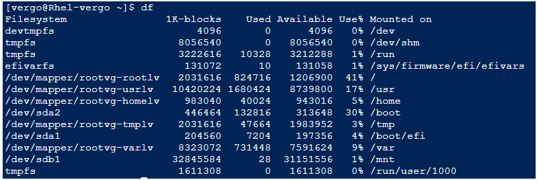
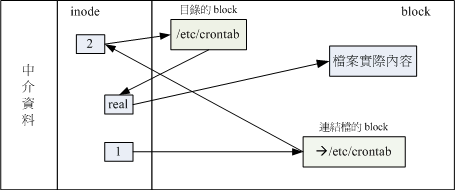

## 7.1 认识Linux文件系统

### 7.1.1 磁盘组成与分区的复习

首先说明一下磁盘的物理组成，整颗磁盘的组成主要有：

圆形的盘片（主要记录数据的部分）；<br>
机械手臂，与在机械手臂上的磁头（可读写盘片上的数据）；<br>
主轴马达，可以转动盘片，让机械手臂的磁头在盘片上读写数据。


从上面我们知道数据储存与读取的重点在于盘片，而盘片上的物理组成则为（假设此磁盘为单碟片， 盘片图示请参考第二章图2.2.1的示意）：

    扇区（Sector）为最小的物理储存单位，且依据磁盘设计的不同，目前主要有 512Bytes 与 4K 两种格式；
    将扇区组成一个圆，那就是柱面（Cylinder）；
    早期的分区主要以柱面为最小分区单位，现在的分区通常使用扇区为最小分区单位（每个扇区都有其号码喔，就好像座位一样）；
    磁盘分区表主要有两种格式，一种是限制较多的 MBR 分区表，一种是较新且限制较少的 GPT 分区表。
    MBR 分区表中，第一个扇区最重要，里面有：
    （1）主要开机区（Master boot record, MBR）及分区表（partition table）， 其中 MBR 占有 446 Bytes，而 partition table 则占有 64 Bytes。
    GPT 分区表除了分区数量扩充较多之外，支持的磁盘容量也可以超过 2TB。


至于磁盘的文件名部份，基本上，所有实体磁盘的文件名都已经被仿真成 /dev/sd[a-p] 的格式，第一颗磁盘文件名为 /dev/sda。 而分区的文件名若以第一颗磁盘为例，则为 /dev/sda[1-128] 。除了实体磁盘之外，虚拟机的磁盘通常为 /dev/vd[a-p] 的格式。 若有使用到软件磁盘阵列的话，那还有 /dev/md[0-128] 的磁盘文件名。使用的是 LVM 时，文件名则为 /dev/VGNAME/LVNAME 等格式。 关于软件磁盘阵列与 LVM 我们会在后面继续介绍，这里主要介绍的以实体磁盘及虚拟磁盘为主喔！      

    /dev/sd[a-p][1-128]：为实体磁盘的磁盘文件名；
    /dev/vd[a-d][1-128]：为虚拟磁盘的磁盘文件名

复习完物理组成后，来复习一下磁盘分区吧！如前所述，以前磁盘分区最小单位经常是柱面，但 CentOS 7 的分区软件， 已经将最小单位改成扇区了，所以容量大小的分区可以切的更细～此外，由于新的大容量磁盘大多得要使用 GPT 分区表才能够使用全部的容量， 因此过去那个 MBR 的传统磁盘分区表限制就不会存在了。不过，由于还是有小磁盘啊！因此， 你在处理分区的时候，还是得要先查询一下，你的分区是 MBR 的分区？还是 GPT 的分区？在第三章的 CentOS 7 安装中， 鸟哥建议过强制使用 GPT 分区喔！所以本章后续的动作，大多还是以 GPT 为主来介绍喔！旧的 MBR 相关限制回去看看第二章吧！

### 7.1.2 文件系统特性
我们都知道磁盘分区完毕后还需要进行格式化（format），之后操作系统才能够使用这个文件系统。 为什么需要进行“格式化”呢？这是因为每种操作系统所设置的文件属性/权限并不相同， 为了存放这些文件所需的数据，因此就需要将分区进行格式化，以成为操作系统能够利用的“文件系统格式（filesystem）”。

由此我们也能够知道，每种操作系统能够使用的文件系统并不相同。 举例来说，windows 98 以前的微软操作系统主要利用的文件系统是 FAT （或 FAT16），windows 2000 以后的版本有所谓的 NTFS 文件系统，至于 Linux 的正统文件系统则为 Ext2 （Linux second extended file system, ext2fs）这一个。此外，在默认的情况下，windows 操作系统是不会认识 Linux 的 Ext2 的。

传统的磁盘与文件系统之应用中，一个分区就是只能够被格式化成为一个文件系统，所以我们可以说一个 filesystem 就是一个 partition。但是由于新技术的利用，例如我们常听到的LVM与软件磁盘阵列（software raid）， 这些技术可以将一个分区格式化为多个文件系统（例如LVM），也能够将多个分区合成一个文件系统（LVM, RAID）！ 所以说，目前我们在格式化时已经不再说成针对 partition 来格式化了， 通常我们可以称呼一个可被挂载的数据为一个文件系统而不是一个分区喔！

那么文件系统是如何运行的呢？这与操作系统的文件数据有关。较新的操作系统的文件数据除了文件实际内容外， 通常含有非常多的属性，例如 Linux 操作系统的文件权限（rwx）与文件属性（拥有者、群组、时间参数等）。 文件系统通常会将这两部份的数据分别存放在不同的区块，权限与属性放置到 inode 中，至于实际数据则放置到 data block 区块中。 另外，还有一个超级区块 （superblock） 会记录整个文件系统的整体信息，包括 inode 与 block 的总量、使用量、剩余量等。

每个 inode 与 block 都有编号，至于这三个数据的意义可以简略说明如下：

    superblock：记录此 filesystem 的整体信息，包括inode/block的总量、使用量、剩余量， 以及文件系统的格式与相关信息等；
    inode：记录文件的属性，一个文件占用一个inode，同时记录此文件的数据所在的 block 号码；
    block：实际记录文件的内容，若文件太大时，会占用多个 block 。

由于每个 inode 与 block 都有编号，而每个文件都会占用一个 inode ，inode 内则有文件数据放置的 block 号码。 因此，我们可以知道的是，如果能够找到文件的 inode 的话，那么自然就会知道这个文件所放置数据的 block 号码， 当然也就能够读出该文件的实际数据了。这是个比较有效率的作法，因为如此一来我们的磁盘就能够在短时间内读取出全部的数据， 读写的性能比较好啰。

我们将 inode 与 block 区块用图解来说明一下，如下图所示，文件系统先格式化出 inode 与 block 的区块，假设某一个文件的属性与权限数据是放置到 inode 4 号（下图较小方格内），而这个 inode 记录了文件数据的实际放置点为 2, 7, 13, 15 这四个 block 号码，此时我们的操作系统就能够据此来排列磁盘的读取顺序，可以一口气将四个 block 内容读出来！ 那么数据的读取就如同下图中的箭头所指定的模样了。


这种数据存取的方法我们称为索引式文件系统（indexed allocation）。那有没有其他的惯用文件系统可以比较一下啊？ 有的，那就是我们惯用的U盘（闪存），U盘使用的文件系统一般为 FAT 格式。FAT 这种格式的文件系统并没有 inode 存在，所以 FAT 没有办法将这个文件的所有 block 在一开始就读取出来。每个 block 号码都记录在前一个 block 当中， 他的读取方式有点像下面这样：


上图中我们假设文件的数据依序写入1->7->4->15号这四个 block 号码中， 但这个文件系统没有办法一口气就知道四个 block 的号码，他得要一个一个的将 block 读出后，才会知道下一个 block 在何处。 如果同一个文件数据写入的 block 分散的太过厉害时，则我们的磁头将无法在磁盘转一圈就读到所有的数据， 因此磁盘就会多转好几圈才能完整的读取到这个文件的内容！

常常会听到所谓的“磁盘重组”吧？ 需要磁盘重组的原因就是文件写入的 block 太过于离散了，此时文件读取的性能将会变的很差所致。 这个时候可以通过磁盘重组将同一个文件所属的 blocks 汇整在一起，这样数据的读取会比较容易啊！ 想当然尔，FAT 的文件系统需要三不五时的磁盘重组一下，那么 Ext2 是否需要磁盘重整呢？

由于 Ext2 是索引式文件系统，基本上不太需要常常进行磁盘重组的。但是如果文件系统使用太久， 常常删除/编辑/新增文件时，那么还是可能会造成文件数据太过于离散的问题，此时或许会需要进行重整一下的。 不过，老实说，鸟哥倒是没有在 Linux 操作系统上面进行过 Ext2/Ext3 文件系统的磁盘重组说！似乎不太需要啦！^_^

### 7.1.3 Linux的EXT2文件系统(inode)
而如同前一小节所说的，inode 的内容在记录文件的权限与相关属性，至于 block 区块则是在记录文件的实际内容。 而且文件系统一开始就将 inode 与 block 规划好了，除非重新格式化（或者利用 resize2fs 等指令变更文件系统大小），否则 inode 与 block 固定后就不再变动。但是如果仔细考虑一下，如果我的文件系统高达数百GB时， 那么将所有的 inode 与 block 通通放置在一起将是很不智的决定，因为 inode 与 block 的数量太庞大，不容易管理。

为此之故，因此 Ext2 文件系统在格式化的时候基本上是区分为多个区块群组 （block group） 的，每个区块群组都有独立的 inode/block/superblock 系统。感觉上就好像我们在当兵时，一个营里面有分成数个连，每个连有自己的联络系统， 但最终都向营部回报连上最正确的信息一般！这样分成一群群的比较好管理啦！整个来说，Ext2 格式化后有点像下面这样：


在整体的规划当中，文件系统最前面有一个开机扇区（boot sector），这个开机扇区可以安装开机管理程序， 这是个非常重要的设计，因为如此一来我们就能够将不同的开机管理程序安装到个别的文件系统最前端，而不用覆盖整颗磁盘唯一的 MBR， 这样也才能够制作出多重开机的环境啊！至于每一个区块群组（block group）的六个主要内容说明如后：

data block （数据区块）
data block 是用来放置文件内容数据地方，在 Ext2 文件系统中所支持的 block 大小有 1K, 2K 及 4K 三种而已。在格式化时 block 的大小就固定了，且每个 block 都有编号，以方便 inode 的记录啦。 不过要注意的是，由于 block 大小的差异，会导致该文件系统能够支持的最大磁盘容量与最大单一文件大小并不相同。 因为 block 大小而产生的 Ext2 文件系统限制如下：


你需要注意的是，虽然 Ext2 已经能够支持大于 2GB 以上的单一文件大小，不过某些应用程序依然使用旧的限制， 也就是说，某些程序只能够捉到小于 2GB 以下的文件而已，这就跟文件系统无关了！ 举例来说，鸟哥在环工方面的应用中有一套秀图软件称为PAVE[3]， 这套软件就无法捉到鸟哥在数值模式仿真后产生的大于 2GB 以上的文件！所以后来只能找更新的软件来取代它了！

除此之外 Ext2 文件系统的 block 还有什么限制呢？有的！基本限制如下：

原则上，block 的大小与数量在格式化完就不能够再改变了（除非重新格式化）；
每个 block 内最多只能够放置一个文件的数据；
承上，如果文件大于 block 的大小，则一个文件会占用多个 block 数量；
承上，若文件小于 block ，则该 block 的剩余容量就不能够再被使用了（磁盘空间会浪费）。


inode table （inode 表格）
再来讨论一下 inode 这个玩意儿吧！如前所述 inode 的内容在记录文件的属性以及该文件实际数据是放置在哪几号 block 内！ 基本上，inode 记录的文件数据至少有下面这些：[4]

    该文件的存取模式（read/write/excute）；
    该文件的拥有者与群组（owner/group）；
    该文件的容量；
    该文件创建或状态改变的时间（ctime）；
    最近一次的读取时间（atime）；
    最近修改的时间（mtime）；
    定义文件特性的旗标（flag），如 SetUID...；
    该文件真正内容的指向 （pointer）；
    inode 的数量与大小也是在格式化时就已经固定了，除此之外 inode 还有些什么特色呢？

    inode 的数量与大小也是在格式化时就已经固定了，除此之外 inode 还有些什么特色呢？

    每个 inode 大小均固定为 128 Bytes （新的 ext4 与 xfs 可设置到 256 Bytes）；
    每个文件都仅会占用一个 inode 而已；
    承上，因此文件系统能够创建的文件数量与 inode 的数量有关；
    系统读取文件时需要先找到 inode，并分析 inode 所记录的权限与使用者是否符合，若符合才能够开始实际读取 block 的内容。


Superblock （超级区块）
Superblock 是记录整个 filesystem 相关信息的地方， 没有 Superblock ，就没有这个 filesystem 了。他记录的信息主要有：

    block 与 inode 的总量；
    未使用与已使用的 inode / block 数量；
    block 与 inode 的大小 （block 为 1, 2, 4K，inode 为 128Bytes 或 256Bytes）；
    filesystem 的挂载时间、最近一次写入数据的时间、最近一次检验磁盘 （fsck） 的时间等文件系统的相关信息；
    一个 valid bit 数值，若此文件系统已被挂载，则 valid bit 为 0 ，若未被挂载，则 valid bit 为 1 。

此外，每个 block group 都可能含有 superblock 喔！但是我们也说一个文件系统应该仅有一个 superblock 而已，那是怎么回事啊？ 事实上除了第一个 block group 内会含有 superblock 之外，后续的 block group 不一定含有 superblock ， 而若含有 superblock 则该 superblock 主要是做为第一个 block group 内 superblock 的备份咯，这样可以进行 superblock 的救援呢！

Filesystem Description （文件系统描述说明）
这个区段可以描述每个 block group 的开始与结束的 block 号码，以及说明每个区段 （superblock, bitmap, inodemap, data block） 分别介于哪一个 block 号码之间。这部份也能够用 dumpe2fs 来观察的。

block bitmap （区块对照表）
如果你想要新增文件时总会用到 block 吧！那你要使用哪个 block 来记录呢？当然是选择“空的 block ”来记录新文件的数据啰。 那你怎么知道哪个 block 是空的？这就得要通过 block bitmap 的辅助了。从 block bitmap 当中可以知道哪些 block 是空的，因此我们的系统就能够很快速的找到可使用的空间来处置文件啰。

同样的，如果你删除某些文件时，那么那些文件原本占用的 block 号码就得要释放出来， 此时在 block bitmap 当中相对应到该 block 号码的标志就得要修改成为“未使用中”啰！这就是 bitmap 的功能。

inode bitmap （inode 对照表）
这个其实与 block bitmap 是类似的功能，只是 block bitmap 记录的是使用与未使用的 block 号码， 至于 inode bitmap 则是记录使用与未使用的 inode 号码啰！

dumpe2fs： 查询 Ext 家族 superblock 信息的指令
了解了文件系统的概念之后，再来当然是观察这个文件系统啰！刚刚谈到的各部分数据都与 block 号码有关！ 每个区段与 superblock 的信息都可以使用 dumpe2fs 这个指令来查询的！不过很可惜的是，我们的 CentOS 7 现在是以 xfs 为默认文件系统， 所以目前你的系统应该无法使用 dumpe2fs 去查询任何文件系统的。没关系，鸟哥先找自己的一部机器来跟大家介绍， 你可以在后续的格式化内容讲完之后，自己切出一个 ext4 的文件系统去查询看看即可。鸟哥这块文件系统是 1GB 的容量，使用默认方式来进行格式化的， 观察的内容如下：

## 7.1.4 与目录树的关系
由前一小节的介绍我们知道在 Linux 系统下，每个文件（不管是一般文件还是目录文件）都会占用一个 inode ， 且可依据文件内容的大小来分配多个 block 给该文件使用。而由第五章的权限说明中我们知道目录的内容在记录文件名， 一般文件才是实际记录数据内容的地方。那么目录与文件在文件系统当中是如何记录数据的呢？基本上可以这样说：

目录
当我们在 Linux 下的文件系统创建一个目录时，文件系统会分配一个 inode 与至少一块 block 给该目录。其中，inode 记录该目录的相关权限与属性，并可记录分配到的那块 block 号码； 而 block 则是记录在这个目录下的文件名与该文件名占用的 inode 号码数据。也就是说目录所占用的 block 内容在记录如下的信息：

目录占用的 block 记录的数据示意图图7.1.5、记载于目录所属的 block 内的文件名与 inode 号码对应示意图


目录树读取：
好了，经过上面的说明你也应该要很清楚的知道 inode 本身并不记录文件名，文件名的记录是在目录的 block 当中。 因此在第五章文件与目录的权限说明中， 我们才会提到“新增/删除/更名文件名与目录的 w 权限有关”的特色！那么因为文件名是记录在目录的 block 当中， 因此当我们要读取某个文件时，就务必会经过目录的 inode 与 block ，然后才能够找到那个待读取文件的 inode 号码， 最终才会读到正确的文件的 block 内的数据。

由于目录树是由根目录开始读起，因此系统通过挂载的信息可以找到挂载点的 inode 号码，此时就能够得到根目录的 inode 内容，并依据该 inode 读取根目录的 block 内的文件名数据，再一层一层的往下读到正确的文件名。举例来说，如果我想要读取 /etc/passwd 这个文件时，系统是如何读取的呢？


    / 的 inode： 通过挂载点的信息找到 inode 号码为 128 的根目录 inode，且 inode 规范的权限让我们可以读取该 block 的内容（有 r 与 x） ；

    / 的 block： 经过上个步骤取得 block 的号码，并找到该内容有 etc/ 目录的 inode 号码 （33595521）；

    etc/ 的 inode： 读取 33595521 号 inode 得知 dmtsai 具有 r 与 x 的权限，因此可以读取 etc/ 的 block 内容；

    etc/ 的 block： 经过上个步骤取得 block 号码，并找到该内容有 passwd 文件的 inode 号码 （36628004）；

    passwd 的 inode： 读取 36628004 号 inode 得知 dmtsai 具有 r 的权限，因此可以读取 passwd 的 block 内容；

    passwd 的 block： 最后将该 block 内容的数据读出来。

    filesystem 大小与磁盘读取性能：

另外，关于文件系统的使用效率上，当你的一个文件系统规划的很大时，例如 100GB 这么大时， 由于磁盘上面的数据总是来来去去的，所以，整个文件系统上面的文件通常无法连续写在一起（block 号码不会连续的意思）， 而是填入式的将数据填入没有被使用的 block 当中。如果文件写入的 block 真的分的很散， 此时就会有所谓的文件数据离散的问题发生了。

如前所述，虽然我们的 ext2 在 inode 处已经将该文件所记录的 block 号码都记上了， 所以数据可以一次性读取，但是如果文件真的太过离散，确实还是会发生读取效率低落的问题。 因为磁头还是得要在整个文件系统中来来去去的频繁读取！ 果真如此，那么可以将整个 filesystme 内的数据全部复制出来，将该 filesystem 重新格式化， 再将数据给他复制回去即可解决这个问题。

此外，如果 filesystem 真的太大了，那么当一个文件分别记录在这个文件系统的最前面与最后面的 block 号码中， 此时会造成磁盘的机械手臂移动幅度过大，也会造成数据读取性能的低落。而且磁头在搜寻整个 filesystem 时， 也会花费比较多的时间去搜寻！因此， partition 的规划并不是越大越好， 而是真的要针对您的主机用途来进行规划才行！^_^


### 7.1.5 EXT2/EXT3/EXT4 文件的存取与日志式文件系统的功能
上一小节谈到的仅是读取而已，那么如果是新建一个文件或目录时，我们的文件系统是如何处理的呢？ 这个时候就得要 block bitmap 及 inode bitmap 的帮忙了！假设我们想要新增一个文件，此时文件系统的行为是：

    先确定使用者对于欲新增文件的目录是否具有 w 与 x 的权限，若有的话才能新增；
    根据 inode bitmap 找到没有使用的 inode 号码，并将新文件的权限/属性写入；
    根据 block bitmap 找到没有使用中的 block 号码，并将实际的数据写入 block 中，且更新 inode 的 block 指向数据；
    将刚刚写入的 inode 与 block 数据同步更新 inode bitmap 与 block bitmap，并更新 superblock 的内容。


一般来说，我们将 inode table 与 data block 称为数据存放区域，至于其他例如 superblock、 block bitmap 与 inode bitmap 等区段就被称为 metadata （中介数据） 啰，因为 superblock, inode bitmap 及 block bitmap 的数据是经常变动的，每次新增、移除、编辑时都可能会影响到这三个部分的数据，因此才被称为中介数据的啦。 

Data inconsistent
在一般正常的情况下，上述的新增动作当然可以顺利的完成。但是如果有个万一怎么办？ 例如你的文件在写入文件系统时，因为不知名原因导致系统中断（例如突然的停电啊、 系统核心发生错误啊～等等的怪事发生时），所以写入的数据仅有 inode table 及 data block 而已， 最后一个同步更新中介数据的步骤并没有做完，此时就会发生 metadata 的内容与实际数据存放区产生不一致 （Inconsistent） 的情况了。

日志式文件系统 （Journaling filesystem）
为了避免上述提到的文件系统不一致的情况发生，因此我们的前辈们想到一个方式， 如果在我们的 filesystem 当中规划出一个区块，该区块专门在记录写入或修订文件时的步骤， 那不就可以简化一致性检查的步骤了？也就是说：

    预备：当系统要写入一个文件时，会先在日志记录区块中纪录某个文件准备要写入的信息；
    实际写入：开始写入文件的权限与数据；开始更新 metadata 的数据；
    结束：完成数据与 metadata 的更新后，在日志记录区块当中完成该文件的纪录。

在这样的程序当中，万一数据的纪录过程当中发生了问题，那么我们的系统只要去检查日志记录区块， 就可以知道哪个文件发生了问题，针对该问题来做一致性的检查即可，而不必针对整块 filesystem 去检查， 这样就可以达到快速修复 filesystem 的能力了！这就是日志式文件最基础的功能啰～


### 7.1.6 Linux 文件系统的运行
我们现在知道了目录树与文件系统的关系了，但是由第零章的内容我们也知道， 所有的数据都得要载入到内存后 CPU 才能够对该数据进行处理。想一想，如果你常常编辑一个好大的文件， 在编辑的过程中又频繁的要系统来写入到磁盘中，由于磁盘写入的速度要比内存慢很多， 因此你会常常耗在等待磁盘的写入/读取上。真没效率！

为了解决这个效率的问题，因此我们的 Linux 使用的方式是通过一个称为非同步处理 （asynchronously） 的方式。所谓的非同步处理是这样的：

当系统载入一个文件到内存后，如果该文件没有被更动过，则在内存区段的文件数据会被设置为干净（clean）的。 但如果内存中的文件数据被更改过了（例如你用 nano 去编辑过这个文件），此时该内存中的数据会被设置为脏的 （Dirty）。此时所有的动作都还在内存中执行，并没有写入到磁盘中！ 系统会不定时的将内存中设置为“Dirty”的数据写回磁盘，以保持磁盘与内存数据的一致性。 你也可以利用第四章谈到的 sync指令来手动强迫写入磁盘。

我们知道内存的速度要比磁盘快的多，因此如果能够将常用的文件放置到内存当中，这不就会增加系统性能吗？ 没错！是有这样的想法！因此我们 Linux 系统上面文件系统与内存有非常大的关系喔：

    系统会将常用的文件数据放置到内存的缓冲区，以加速文件系统的读/写；
    承上，因此 Linux 的实体内存最后都会被用光！这是正常的情况！可加速系统性能；
    你可以手动使用 sync 来强迫内存中设置为 Dirty 的文件回写到磁盘中；
    若正常关机时，关机指令会主动调用 sync 来将内存的数据回写入磁盘内；
    但若不正常关机（如跳电、死机或其他不明原因），由于数据尚未回写到磁盘内， 因此重新开机后可能会花很多时间在进行磁盘检验，甚至可能导致文件系统的损毁（非磁盘损毁）。


## 7.1.7 挂载点的意义 （mount point）
每个 filesystem 都有独立的 inode / block / superblock 等信息，这个文件系统要能够链接到目录树才能被我们使用。 将文件系统与目录树结合的动作我们称为“挂载”。 关于挂载的一些特性我们在第二章稍微提过， 重点是：挂载点一定是目录，该目录为进入该文件系统的入口。 因此并不是你有任何文件系统都能使用，必须要“挂载”到目录树的某个目录后，才能够使用该文件系统的。

看到了吧！由于 XFS filesystem 最顶层的目录之 inode 一般为 128 号，因此可以发现 /, /boot, /home 为三个不同的 filesystem 啰！ （因为每一行的文件属性并不相同，且三个目录的挂载点也均不相同之故。） 我们在第六章一开始的路径中曾经提到根目录下的 . 与 .. 是相同的东西， 因为权限是一模一样嘛！如果使用文件系统的观点来看，同一个 filesystem 的某个 inode 只会对应到一个文件内容而已（因为一个文件占用一个 inode 之故）， 因此我们可以通过判断 inode 号码来确认不同文件名是否为相同的文件喔！所以可以这样看：

    [root@study ~]# ls -ild /  /.  /..
    128 dr-xr-xr-x. 17 root root 4096 May  4 17:56 /
    128 dr-xr-xr-x. 17 root root 4096 May  4 17:56 /.
    128 dr-xr-xr-x. 17 root root 4096 May  4 17:56 /..

上面的信息中由于挂载点均为 / ，因此三个文件 （/, /., /..） 均在同一个 filesystem 内，而这三个文件的 inode 号码均为 128 号，因此这三个文件名都指向同一个 inode 号码，当然这三个文件的内容也就完全一模一样了！ 也就是说，根目录的上层 （/..） 就是他自己！


### 7.1.8 其他 Linux 支持的文件系统与 VFS

虽然 Linux 的标准文件系统是 ext2 ，且还有增加了日志功能的 ext3/ext4 ，事实上，Linux 还有支持很多文件系统格式的， 尤其是最近这几年推出了好几种速度很快的日志式文件系统，包括 SGI 的 XFS 文件系统， 可以适用更小型文件的 Reiserfs 文件系统，以及 Windows 的 FAT 文件系统等等， 都能够被 Linux 所支持喔！常见的支持文件系统有：

    传统文件系统：ext2 / minix / MS-DOS / FAT （用 vfat 模块） / iso9660 （光盘）等等；
    日志式文件系统： ext3 /ext4 / ReiserFS / Windows' NTFS / IBM's JFS / SGI's XFS / ZFS
    网络文件系统： NFS / SMBFS


想要知道你的 Linux 支持的文件系统有哪些，可以察看下面这个目录：

    [root@study ~]# ls -l /lib/modules/$（uname -r）/kernel/fs
系统目前已载入到内存中支持的文件系统则有：

    [root@study ~]# cat /proc/filesystems

了解了我们使用的文件系统之后，再来则是要提到，那么 Linux 的核心又是如何管理这些认识的文件系统呢？ 其实，整个 Linux 的系统都是通过一个名为 Virtual Filesystem Switch 的核心功能去读取 filesystem 的。 也就是说，整个 Linux 认识的 filesystem 其实都是 VFS 在进行管理，我们使用者并不需要知道每个 partition 上头的 filesystem 是什么～ VFS 会主动的帮我们做好读取的动作呢～

假设你的 / 使用的是 /dev/hda1 ，用 ext3 ，而 /home 使用 /dev/hda2 ，用 reiserfs ， 那么你取用 /home/dmtsai/.bashrc 时，有特别指定要用的什么文件系统的模块来读取吗？ 应该是没有吧！这个就是 VFS 的功能啦！通过这个 VFS 的功能来管理所有的 filesystem， 省去我们需要自行设置读取文件系统的定义啊～方便很多！整个 VFS 可以约略用下图来说明：


## 7.2 文件系统的简单操作

### 7.2.1 磁盘与目录的容量

现在我们知道磁盘的整体数据是在 superblock 区块中，但是每个各别文件的容量则在 inode 当中记载的。 那在命令行下面该如何叫出这几个数据呢？下面就让我们来谈一谈这两个指令：

    df：列出文件系统的整体磁盘使用量；
    du：评估文件系统的磁盘使用量（常用在推估目录所占容量）



    [root@study ~]# df [-ahikHTm] [目录或文件名]
    选项与参数：
    -a  ：列出所有的文件系统，包括系统特有的 /proc 等文件系统；
    -k  ：以 KBytes 的容量显示各文件系统；
    -m  ：以 MBytes 的容量显示各文件系统；
    -h  ：以人们较易阅读的 GBytes, MBytes, KBytes 等格式自行显示；
    -H  ：以 M=1000K 取代 M=1024K 的进位方式；
    -T  ：连同该 partition 的 filesystem 名称 （例如 xfs） 也列出；
    -i  ：不用磁盘容量，而以 inode 的数量来显示

    Filesystem：代表该文件系统是在哪个 partition ，所以列出设备名称；
    1k-blocks：说明下面的数字单位是 1KB 呦！可利用 -h 或 -m 来改变容量；
    Used：顾名思义，就是使用掉的磁盘空间啦！
    Available：也就是剩下的磁盘空间大小；
    Use%：就是磁盘的使用率啦！如果使用率高达 90% 以上时， 最好需要注意一下了，免得容量不足造成系统问题喔！（例如最容易被灌爆的 /var/spool/mail 这个放置邮件的磁盘）
    Mounted on：就是磁盘挂载的目录所在啦！（挂载点啦！）

由于 df 主要读取的数据几乎都是针对一整个文件系统，因此读取的范围主要是在 Superblock 内的信息， 所以这个指令显示结果的速度非常的快速！在显示的结果中你需要特别留意的是那个根目录的剩余容量！ 因为我们所有的数据都是由根目录衍生出来的，因此当根目录的剩余容量剩下 0 时，那你的 Linux 可能就问题很大了。

另外需要注意的是，如果使用 -a 这个参数时，系统会出现 /proc 这个挂载点，但是里面的东西都是 0 ，不要紧张！ /proc 的东西都是 Linux 系统所需要载入的系统数据，而且是挂载在“内存当中”的， 所以当然没有占任何的磁盘空间啰！

至于那个 /dev/shm/ 目录，其实是利用内存虚拟出来的磁盘空间，通常是总实体内存的一半！ 由于是通过内存仿真出来的磁盘，因此你在这个目录下面创建任何数据文件时，存取速度是非常快速的！（在内存内工作） 不过，也由于他是内存仿真出来的，因此这个文件系统的大小在每部主机上都不一样，而且创建的东西在下次开机时就消失了！ 因为是在内存中嘛！


du:

    [root@study ~]# du [-ahskm] 文件或目录名称
    选项与参数：
    -a  ：列出所有的文件与目录容量，因为默认仅统计目录下面的文件量而已。
    -h  ：以人们较易读的容量格式 （G/M） 显示；
    -s  ：列出总量而已，而不列出每个各别的目录占用容量；
    -S  ：不包括子目录下的总计，与 -s 有点差别。
    -k  ：以 KBytes 列出容量显示；
    -m  ：以 MBytes 列出容量显示；


lsblk 命令在 Linux 中用于列出所有可用或指定的块设备的信息。它以树状格式显示设备，展示它们的层次结构和属性，如名称、大小、类型和挂载点。

以下是一些常用的 lsblk 参数：

    -a：在输出中包括空设备。
    -f：显示文件系统信息。
    -l：生成列表而不是树状结构。
    -o：指定要显示的列。例如，lsblk -o NAME,SIZE,TYPE,MOUNTPOINT。
    -d：仅显示设备本身，不显示其分区。
    -n：省略标题行。
    -p：显示完整的设备路径。
    -r：仅显示可移动设备。
    -t：显示拓扑信息。
    -J：以 JSON 格式输出。
    -P：以键=值对的形式输出。


### 7.2.2 实体链接与符号链接： ln
在 Linux 下面的链接文件有两种，一种是类似 Windows 的捷径功能的文件，可以让你快速的链接到目标文件（或目录）； 另一种则是通过文件系统的 inode 链接来产生新文件名，而不是产生新文件！这种称为实体链接 （hard link）。 这两种玩意儿是完全不一样的东西呢！现在就分别来谈谈。

Hard Link （实体链接, 硬式链接或实际链接）
在前一小节当中，我们知道几件重要的信息，包括：

    每个文件都会占用一个 inode ，文件内容由 inode 的记录来指向；
    想要读取该文件，必须要经过目录记录的文件名来指向到正确的 inode 号码才能读取。
也就是说，其实文件名只与目录有关，但是文件内容则与 inode 有关。那么想一想， 有没有可能有多个文件名对应到同一个 inode 号码呢？有的！那就是 hard link 的由来。 所以简单的说：hard link 只是在某个目录下新增一笔文件名链接到某 inode 号码的关连记录而已。

举个例子来说，假设我系统有个 /root/crontab 他是 /etc/crontab 的实体链接，也就是说这两个文件名链接到同一个 inode ， 自然这两个文件名的所有相关信息都会一模一样（除了文件名之外）。实际的情况可以如下所示：

    [root@study ~]# ll -i /etc/crontab
    34474855 -rw-r--r--. 1 root root 451 Jun 10  2014 /etc/crontab

    [root@study ~]# ln /etc/crontab .   &lt;==创建实体链接的指令
    [root@study ~]# ll -i /etc/crontab crontab
    34474855 -rw-r--r--. 2 root root 451 Jun 10  2014 crontab
    34474855 -rw-r--r--. 2 root root 451 Jun 10  2014 /etc/crontab

你可以发现两个文件名都链接到 34474855 这个 inode 号码，所以您瞧瞧，是否文件的权限/属性完全一样呢？ 因为这两个“文件名”其实是一模一样的“文件”啦！而且你也会发现第二个字段由原本的 1 变成 2 了！ 那个字段称为“链接”，这个字段的意义为：“有多少个文件名链接到这个 inode 号码”的意思。 如果将读取到正确数据的方式画成示意图，就类似如下画面：


上图的意思是，你可以通过 1 或 2 的目录之 inode 指定的 block 找到两个不同的文件名，而不管使用哪个文件名均可以指到 real 那个 inode 去读取到最终数据！那这样有什么好处呢？最大的好处就是“安全”！如同上图中， 如果你将任何一个“文件名”删除，其实 inode 与 block 都还是存在的！ 此时你可以通过另一个“文件名”来读取到正确的文件数据喔！此外，不论你使用哪个“文件名”来编辑， 最终的结果都会写入到相同的 inode 与 block 中，因此均能进行数据的修改哩！

一般来说，使用 hard link 设置链接文件时，磁盘的空间与 inode 的数目都不会改变！ 我们还是由图 7.2.1 来看，由图中可以知道， hard link 只是在某个目录下的 block 多写入一个关连数据而已，既不会增加 inode 也不会耗用 block 数量哩！

ard link 的制作中，其实还是可能会改变系统的 block 的，那就是当你新增这笔数据却刚好将目录的 block 填满时，就可能会新加一个 block 来记录文件名关连性，而导致磁盘空间的变化！不过，一般 hard link 所用掉的关连数据量很小，所以通常不会改变 inode 与磁盘空间的大小喔！

由图 7.2.1 其实我们也能够知道，事实上 hard link 应该仅能在单一文件系统中进行的，应该是不能够跨文件系统才对！ 因为图 7.2.1 就是在同一个 filesystem 上嘛！所以 hard link 是有限制的：

    不能跨 Filesystem；
    不能 link 目录。

不能跨 Filesystem 还好理解，那不能 hard link 到目录又是怎么回事呢？这是因为如果使用 hard link 链接到目录时， 链接的数据需要连同被链接目录下面的所有数据都创建链接，举例来说，如果你要将 /etc 使用实体链接创建一个 /etc_hd 的目录时，那么在 /etc_hd 下面的所有文件名同时都与 /etc 下面的文件名要创建 hard link 的，而不是仅链接到 /etc_hd 与 /etc 而已。 并且，未来如果需要在 /etc_hd 下面创建新文件时，连带的， /etc 下面的数据又得要创建一次 hard link ，因此造成环境相当大的复杂度。 所以啰，目前 hard link 对于目录暂时还是不支持的啊！

Symbolic Link （符号链接，亦即是捷径）

相对于 hard link ， Symbolic link 可就好理解多了，基本上， Symbolic link 就是在创建一个独立的文件，而这个文件会让数据的读取指向他 link 的那个文件的文件名！由于只是利用文件来做为指向的动作， 所以，当来源文件被删除之后，symbolic link 的文件会“开不了”， 会一直说“无法打开某文件！”。实际上就是找不到原始“文件名”而已啦！

    [root@study ~]# ln -s /etc/crontab crontab2
    [root@study ~]# ll -i /etc/crontab /root/crontab2
    34474855 -rw-r--r--. 2 root root 451 Jun 10  2014 /etc/crontab
    53745909 lrwxrwxrwx. 1 root root  12 Jun 23 22:31 /root/crontab2 -&gt; /etc/crontab

由上表的结果我们可以知道两个文件指向不同的 inode 号码，当然就是两个独立的文件存在！ 而且链接文件的重要内容就是他会写上目标文件的“文件名”， 你可以发现为什么上表中链接文件的大小为 12 Bytes 呢？ 因为箭头（-->）右边的文件名“/etc/crontab”总共有 12 个英文，每个英文占用 1 个 Bytes ，所以文件大小就是 12Bytes了！


这里还是得特别留意，这个 Symbolic Link 与 Windows 的捷径可以给他划上等号，由 Symbolic link 所创建的文件为一个独立的新的文件，所以会占用掉 inode 与 block 喔！

由上面的说明来看，似乎 hard link 比较安全，因为即使某一个目录下的关连数据被杀掉了， 也没有关系，只要有任何一个目录下存在着关连数据，那么该文件就不会不见！举上面的例子来说，我的 /etc/crontab 与 /root/crontab 指向同一个文件，如果我删除了 /etc/crontab 这个文件，该删除的动作其实只是将 /etc 目录下关于 crontab 的关连数据拿掉而已， crontab 所在的 inode 与 block 其实都没有被变动喔！


    [root@study ~]# ln [-sf] 来源文件 目标文件
选项与参数：
-s  ：如果不加任何参数就进行链接，那就是hard link，至于 -s 就是symbolic link
-f  ：如果 目标文件 存在时，就主动的将目标文件直接移除后再创建！

    范例一：将 /etc/passwd 复制到 /tmp 下面，并且观察 inode 与 block
    [root@study ~]# cd /tmp
    [root@study tmp]# cp -a /etc/passwd .
    [root@study tmp]# du -sb ; df -i .
    6602    .   &lt;==先注意一下这里的容量是多少！
    Filesystem                Inodes  IUsed    IFree IUse% Mounted on
    /dev/mapper/centos-root 10485760 109748 10376012    2% /
    # 利用 du 与 df 来检查一下目前的参数～那个 du -sb 是计算整个 /tmp 下面有多少 Bytes 的容量啦！

    范例二：将 /tmp/passwd 制作 hard link 成为 passwd-hd 文件，并观察文件与容量
    [root@study tmp]# ln passwd passwd-hd
    [root@study tmp]# du -sb ; df -i .
    6602    .
    Filesystem                Inodes  IUsed    IFree IUse% Mounted on
    /dev/mapper/centos-root 10485760 109748 10376012    2% /
    # 仔细看，即使多了一个文件在 /tmp 下面，整个 inode 与 block 的容量并没有改变！

    [root@study tmp]# ls -il passwd*
    2668897 -rw-r--r--. 2 root root 2092 Jun 17 00:20 passwd
    2668897 -rw-r--r--. 2 root root 2092 Jun 17 00:20 passwd-hd
    # 原来是指向同一个 inode 啊！这是个重点啊！另外，那个第二栏的链接数也会增加！

    范例三：将 /tmp/passwd 创建一个符号链接
    [root@study tmp]# ln -s passwd passwd-so
    [root@study tmp]# ls -li passwd*
    2668897 -rw-r--r--. 2 root root 2092 Jun 17 00:20 passwd
    2668897 -rw-r--r--. 2 root root 2092 Jun 17 00:20 passwd-hd
    2668898 lrwxrwxrwx. 1 root root    6 Jun 23 22:40 passwd-so -&gt; passwd
    # passwd-so 指向的 inode number 不同了！这是一个新的文件～这个文件的内容是指向 
    # passwd 的。passwd-so 的大小是 6Bytes ，因为 “passwd” 这个单字共有六个字符之故

    [root@study tmp]# du -sb ; df -i .
    6608    .
    Filesystem                Inodes  IUsed    IFree IUse% Mounted on
    /dev/mapper/centos-root 10485760 109749 10376011    2% /
    # 呼呼！整个容量与 inode 使用数都改变啰～确实如此啊！

    范例四：删除原始文件 passwd ，其他两个文件是否能够打开？
    [root@study tmp]# rm passwd
    [root@study tmp]# cat passwd-hd
    .....（正常显示完毕！）
    [root@study tmp]# cat passwd-so
    cat: passwd-so: No such file or directory
    [root@study tmp]# ll passwd*
    -rw-r--r--. 1 root root 2092 Jun 17 00:20 passwd-hd
    lrwxrwxrwx. 1 root root    6 Jun 23 22:40 passwd-so -&gt; passwd
    # 怕了吧！符号链接果然无法打开！另外，如果符号链接的目标文件不存在，
    # 其实文件名的部分就会有特殊的颜色显示喔！


要注意啰！使用 ln 如果不加任何参数的话，那么就是 Hard Link 啰！如同范例二的情况，增加了 hard link 之后，可以发现使用 ls -l 时，显示的 link 那一栏属性增加了！而如果这个时候砍掉 passwd 会发生什么事情呢？passwd-hd 的内容还是会跟原来 passwd 相同，但是 passwd-so 就会找不到该文件啦！

而如果 ln 使用 -s 的参数时，就做成差不多是 Windows 下面的“捷径”的意思。当你修改 Linux 下的 symbolic link 文件时，则更动的其实是“原始文件”， 所以不论你的这个原始文件被链接到哪里去，只要你修改了链接文件，原始文件就跟着变啰！ 以上面为例，由于你使用 -s 的参数创建一个名为 passwd-so 的文件，则你修改 passwd-so 时，其内容与 passwd 完全相同，并且，当你按下储存之后，被改变的将是 passwd 这个文件！

或许您已经发现了，那就是，当我们以 hard link 进行“文件的链接”时，可以发现，在 ls -l 所显示的第二字段会增加一才对，那么请教，如果创建目录时，他默认的 link 数量会是多少？ 让我们来想一想，一个“空目录”里面至少会存在些什么？呵呵！就是存在 . 与 .. 这两个目录啊！ 那么，当我们创建一个新目录名称为 /tmp/testing 时，基本上会有三个东西，那就是：

/tmp/testing
/tmp/testing/.
/tmp/testing/..
而其中 /tmp/testing 与 /tmp/testing/. 其实是一样的！都代表该目录啊～而 /tmp/testing/.. 则代表 /tmp 这个目录，所以说，当我们创建一个新的目录时， “新的目录的 link 数为 2 ，而上层目录的 link 数则会增加 1 ” 

## 7.3 磁盘的分区、格式化、检验与挂载
对于一个系统管理者（ root ）而言，磁盘的的管理是相当重要的一环，尤其近来磁盘已经渐渐的被当成是消耗品了 ..... 如果我们想要在系统里面新增一颗磁盘时，应该有哪些动作需要做的呢：

    对磁盘进行分区，以创建可用的 partition ；
    对该 partition 进行格式化 （format），以创建系统可用的 filesystem；
    若想要仔细一点，则可对刚刚创建好的 filesystem 进行检验；
    在 Linux 系统上，需要创建挂载点 （亦即是目录），并将他挂载上来；
当然啰，在上述的过程当中，还有很多需要考虑的，例如磁盘分区 （partition） 需要定多大？ 是否需要加入 journal 的功能？inode 与 block 的数量应该如何规划等等的问题。但是这些问题的决定， 都需要与你的主机用途来加以考虑的～所以，在这个小节里面，鸟哥仅会介绍几个动作而已， 更详细的设置值，则需要以你未来的经验来参考啰！

### 7.3.1 观察磁盘分区状态
由于目前磁盘分区主要有 MBR 以及 GPT 两种格式，这两种格式所使用的分区工具不太一样！你当然可以使用本章预计最后才介绍的 parted 这个通通有支持的工具来处理，不过，我们还是比较习惯使用 fdisk 或者是 gdisk 来处理分区啊！因此，我们自然就得要去找一下目前系统有的磁盘有哪些？ 这些磁盘是 MBR 还是 GPT 等等的！这样才能处理啦！
lsblk 列出系统上的所有磁盘列表
lsblk 可以看成“ list block device ”的缩写，就是列出所有储存设备的意思！这个工具软件真的很好用喔！来瞧一瞧！

    [root@study ~]# lsblk [-dfimpt] [device]
    选项与参数：
    -d  ：仅列出磁盘本身，并不会列出该磁盘的分区数据
    -f  ：同时列出该磁盘内的文件系统名称
    -i  ：使用 ASCII 的线段输出，不要使用复杂的编码 （再某些环境下很有用）
    -m  ：同时输出该设备在 /dev 下面的权限数据 （rwx 的数据）
    -p  ：列出该设备的完整文件名！而不是仅列出最后的名字而已。
    -t  ：列出该磁盘设备的详细数据，包括磁盘伫列机制、预读写的数据量大小等

    NAME：就是设备的文件名啰！会省略 /dev 等前导目录！
    MAJ:MIN：其实核心认识的设备都是通过这两个代码来熟悉的！分别是主要：次要设备代码！
    RM：是否为可卸载设备 （removable device），如光盘、USB 磁盘等等
    SIZE：当然就是容量啰！
    RO：是否为只读设备的意思
    TYPE：是磁盘 （disk）、分区 （partition） 还是只读存储器 （rom） 等输出
    MOUTPOINT：就是前一章谈到的挂载点！


blkid 列出设备的 UUID 等参数
虽然 lsblk 已经可以使用 -f 来列出文件系统与设备的 UUID 数据，不过，鸟哥还是比较习惯直接使用 blkid 来找出设备的 UUID 喔！ 什么是 UUID 呢？UUID 是全域单一识别码 （universally unique identifier），Linux 会将系统内所有的设备都给予一个独一无二的识别码， 这个识别码就可以拿来作为挂载或者是使用这个设备/文件系统之用了。

    [root@study ~]# blkid
    /dev/vda2: UUID="94ac5f77-cb8a-495e-a65b-2ef7442b837c" TYPE="xfs" 
    /dev/vda3: UUID="WStYq1-P93d-oShM-JNe3-KeDl-bBf6-RSmfae" TYPE="LVM2_member"
    /dev/sda1: UUID="35BC-6D6B" TYPE="vfat"
    /dev/mapper/centos-root: UUID="299bdc5b-de6d-486a-a0d2-375402aaab27" TYPE="xfs"
    /dev/mapper/centos-swap: UUID="905dc471-6c10-4108-b376-a802edbd862d" TYPE="swap"
    /dev/mapper/centos-home: UUID="29979bf1-4a28-48e0-be4a-66329bf727d9" TYPE="xfs"


parted:

    (parted) quit                                                             
    [vergo@Rhel-vergo dev]$ sudo parted /dev/sda print
    Model: Msft Virtual Disk (scsi)
    Disk /dev/sda: 68.7GB
    Sector size (logical/physical): 512B/4096B
    Partition Table: gpt
    Disk Flags: 

    Number  Start   End     Size    File system  Name                  Flags
    1      1049kB  211MB   210MB   fat16        EFI System Partition  boot, esp
    2      211MB   735MB   524MB   xfs
    3      735MB   736MB   1049kB                                     bios_grub
    4      736MB   68.7GB  68.0GB                                     lvm

### 7.3.2 磁盘分区： gdisk/fdisk

接下来我们想要进行磁盘分区啰！要注意的是：“MBR 分区表请使用 fdisk 分区， GPT 分区表请使用 gdisk 分区！” 这个不要搞错～否则会分区失败的！另外，这两个工具软件的操作很类似，执行了该软件后，可以通过该软件内部的说明数据来操作， 因此不需要硬背！只要知道方法即可。刚刚从上面 parted 的输出结果，我们也知道鸟哥这个测试机使用的是 GPT 分区， 因此下面通通得要使用 gdisk 来分区才行！

gdisk:

    [root@study ~]# gdisk 设备名称

范例：由前一小节的 lsblk 输出，我们知道系统有个 /dev/vda，请观察该磁盘的分区与相关数据
[root@study ~]# gdisk /dev/vda  &lt;==仔细看，不要加上数字喔！
GPT fdisk （gdisk） version 0.8.6

Partition table scan:
  MBR: protective
  BSD: not present
  APM: not present
  GPT: present

    Found valid GPT with protective MBR; using GPT.  &lt;==找到了 GPT 的分区表！

    Command （? for help）:     &lt;==这里可以让你输入指令动作，可以按问号 （?） 来查看可用指令
    Command （? for help）: ?
    b       back up GPT data to a file
    c       change a partition's name
    d       delete a partition           # 删除一个分区
    i       show detailed information on a partition
    l       list known partition types
    n       add a new partition          # 增加一个分区
    o       create a new empty GUID partition table （GPT）
    p       print the partition table    # 印出分区表 （常用）
    q       quit without saving changes  # 不储存分区就直接离开 gdisk
    r       recovery and transformation options （experts only）
    s       sort partitions
    t       change a partition's type code
    v       verify disk
    w       write table to disk and exit # 储存分区操作后离开 gdisk
    x       extra functionality （experts only）
    ?       print this menu
    Command （? for help）:


使用“ p ”可以列出目前这颗磁盘的分区表信息，这个信息的上半部在显示整体磁盘的状态。 以鸟哥这颗磁盘为例，这个磁盘共有 40GB 左右的容量，共有 83886080 个扇区，每个扇区的容量为 512Bytes。 要注意的是，现在的分区主要是以扇区为最小的单位喔！

下半部的分区表信息主要在列出每个分区的个别信息项目。每个项目的意义为：

    Number：分区编号，1 号指的是 /dev/vda1 这样计算。
    Start （sector）：每一个分区的开始扇区号码位置
    End （sector）：每一个分区的结束扇区号码位置，与 start 之间可以算出分区的总容量
    Size：就是分区的容量了
    Code：在分区内的可能的文件系统类型。Linux 为 8300，swap 为 8200。不过这个项目只是一个提示而已，不见得真的代表此分区内的文件系统喔！
    Name：文件系统的名称等等。

从上表我们可以发现几件事情：
整部磁盘还可以进行额外的分区，因为最大扇区为 83886080，但只使用到 65026047 号而已；
分区的设计中，新分区通常选用上一个分区的结束扇区号码数加 1 作为起始扇区号码！

这个 gdisk 只有 root 才能执行，此外，请注意，使用的“设备文件名”请不要加上数字，因为 partition 是针对“整个磁盘设备”而不是某个 partition 呢！所以执行“ gdisk /dev/vda1 ” 就会发生错误啦！要使用 gdisk /dev/vda 


用gdisk新增分区<br>

    [root@study ~]# gdisk /dev/vda
    Command （? for help）: p
    Number  Start （sector）    End （sector）  Size       Code  Name
    1            2048            6143   2.0 MiB     EF02
    2            6144         2103295   1024.0 MiB  0700
    3         2103296        65026047   30.0 GiB    8E00
    找出最后一个 sector 的号码是很重要的！

    Command （? for help）: ?  # 查一下增加分区的指令为何
    Command （? for help）: n  # 就是这个！所以开始新增的行为！
    Partition number （4-128, default 4）: 4  # 默认就是 4 号，所以也能 enter 即可！
    First sector （34-83886046, default = 65026048） or {+-}size{KMGTP}: 65026048  # 也能 enter
    Last sector （65026048-83886046, default = 83886046） or {+-}size{KMGTP}: +1G  # 决不要 enter
    这个地方可有趣了！我们不需要自己去计算扇区号码，通过 +容量 的这个方式，
    就可以让 gdisk 主动去帮你算出最接近你需要的容量的扇区号码喔！

    若lsblk没有更新分区信息
    sudo partprobe

    Current type is 'Linux filesystem'
    Hex code or GUID （L to show codes, Enter = 8300）: # 使用默认值即可～直接 enter 下去！
    这里在让你选择未来这个分区预计使用的文件系统！默认都是 Linux 文件系统的 8300 啰！

    Command （? for help）: p
    Number  Start （sector）    End （sector）  Size       Code  Name
    1            2048            6143   2.0 MiB     EF02
    2            6144         2103295   1024.0 MiB  0700
    3         2103296        65026047   30.0 GiB    8E00
        4        65026048        67123199   1024.0 MiB  8300  Linux filesystem
    

重点在“ Last sector ”那一行，那行绝对不要使用默认值！因为默认值会将所有的容量用光！因此它默认选择最大的扇区号码！ 因为我们仅要 1GB 而已，所以你得要加上 +1G 这样即可！不需要计算 sector 的数量，gdisk 会根据你填写的数值， 直接计算出最接近该容量的扇区数！每次新增完毕后，请立即“ p ”查看一下结果喔！请继续处理后续的两个分区！ 最终出现的画面会有点像下面这样才对！

基本上，几乎都用默认值，然后通过 +1G, +500M 来创建所需要的另外两个分区！比较有趣的是文件系统的 ID 啦！一般来说， Linux 大概都是 8200/8300/8e00 等三种格式， Windows 几乎都用 0700 这样，如果忘记这些数字，可以在 gdisk 内按下：“ L ”来显示喔！ 如果一切的分区状态都正常的话，那么就直接写入磁盘分区表吧！

因为 Linux 此时还在使用这颗磁盘，为了担心系统出问题，所以分区表并没有被更新喔！这个时候我们有两个方式可以来处理！ 其中一个是重新开机，不过很讨厌！另外一个则是通过 partprobe 这个指令来处理即可！

- partprobe 更新 Linux 核心的分区表信息

```Shell
[root@study ~]# partprobe [-s]  # 你可以不要加 -s ！那么屏幕不会出现讯息！
[root@study ~]# partprobe -s    # 不过还是建议加上 -s 比较清晰！
/dev/vda: gpt partitions 1 2 3 4 5 6
```