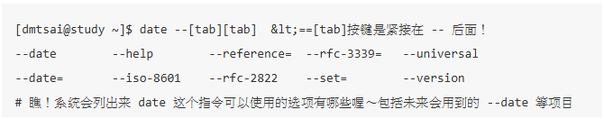

# 第四章

## 4.2.1 开始下达指令
其实整个指令下达的方式很简单，你只要记得几个重要的概念就可以了。举例来说，你可以这样下达指令的：
[dmtsai@study ~]$ command  [-options]  parameter1  parameter2 ..  
指令     选项        参数（1）     参数（2）
1. 一行指令中第一个输入的部分绝对是“指令（command）”或“可可执行文件案（例如批次脚本,script）”
2. command 为指令的名称，例如变换工作目录的指令为 cd 等等；
3. 中刮号[]并不存在于实际的指令中，而加入选项设置时，通常选项前会带 - 号，例如 -h；有时候会使用选项的完整全名，则选项前带有 -- 符号，例如 --help；
4. parameter1 parameter2.. 为依附在选项后面的参数，或者是 command 的参数；
5. 指令, 选项, 参数等这几个咚咚中间以空格来区分，不论空几格 shell 都视为一格。所以空格是很重要的特殊字符！；
6. 按下[Enter]按键后，该指令就立即执行。[Enter]按键代表着一行指令的开始启动。
7. 指令太长的时候，可以使用反斜线 （\） 来跳脱[Enter]符号，使指令连续到下一行。注意！反斜线后就立刻接特殊字符，才能跳脱！
8. 其他：
    1. 在 Linux 系统中，英文大小写字母是不一样的。举例来说， cd 与 CD 并不同。
    2. 更多的介绍等到第十章 bash 时，再来详述。

##  4.2.2 基础指令的操作
下面我们立刻来操作几个简单的指令看看啰！同时请注意，我们已经使用了英文语系作为默认输出的语言喔！

显示日期与时间的指令： date
 
显示日历的指令： cal
 
简单好用的计算机： bc

1. 显示日期的指令： date

如果在命令行中想要知道目前Linux系统的时间，那么就直接在命令行界面输入date即可显示：

[dmtsai@study ~]$ date
Fri May 29 14:32:01 CST 2015
上面显示的是：星期五, 五月二十九日, 14:32 分, 01秒，在 2015 年的 CST 时区！台湾在CST时区中啦！ 请赶快动手做做看呦！好了，那么如果我想要让这个程序显示出“2015/05/29”这样的日期显示方式呢？ 那么就使用date的格式化输出功能吧！

[dmtsai@study ~]$ date +%Y/%m/%d 
2015/05/29 
 
[dmtsai@study ~]$ date +%H:%M 
14:33 
 
那个“+%Y%m%d”就是date指令的一些参数功能啦！很好玩吧！那你问我， 鸟哥怎么知道这些参数的啊？要背起来吗？当然不必啦！下面再告诉你怎么查这些参数啰！

从上面的例子当中我们也可以知道，指令之后的选项除了前面带有减号“-”之外，某些特殊情况下， 选项或参数前面也会带有正号“+”的情况！这部份可不要轻易的忘记了呢！

## 4.2.3 重要的几个热键[Tab], [ctrl]-c, [ctrl]-d
[Tab]按键
[Tab]按键就是在键盘的大写灯切换按键（[Caps Lock]）上面的那个按键！在各种Unix-Like的Shell当中， 这个[Tab]按键算是Linux的Bash shell最棒的功能之一了！他具有“命令补全”与“文件补齐”的功能喔！ 重点是，可以避免我们打错指令或文件名称呢！很棒吧！但是[Tab]按键在不同的地方输入，会有不一样的结果喔！ 我们举下面的例子来说明。上一小节我们不是提到 cal 这个指令吗？如果我在命令行输入 ca 再按两次 [tab] 按键， 会出现什么讯息？

发现什么事？所有以ca为开头的指令都被显示出来啦！很不错吧！那如果你输入“ls -al ~/.bash”再加两个[tab]会出现什么？

在该目录下面所有以 .bash 为开头的文件名称都会被显示出来了呢！注意看上面两个例子喔， 我们按[tab]按键的地方如果是在command（第一个输入的数据）后面时，他就代表着 “命令补全”，如果是接在第二个字以后的，就会变成“文件补齐”的功能了！但是在某些特殊的指令下面，文件补齐的功能可能会变成“参数/选项补齐”喔！ 我们同样使用 date 这个指令来查一下：
