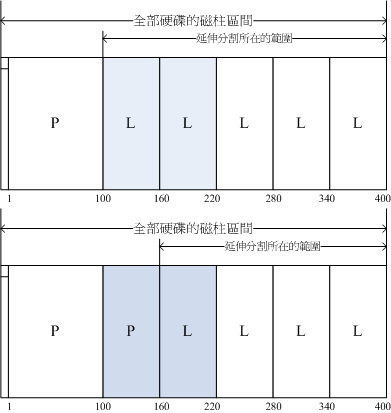
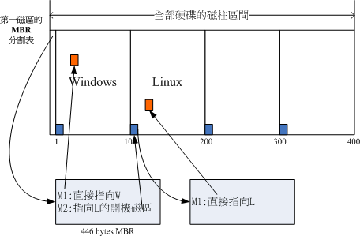
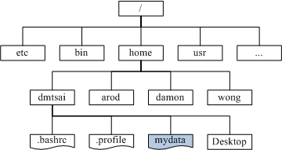
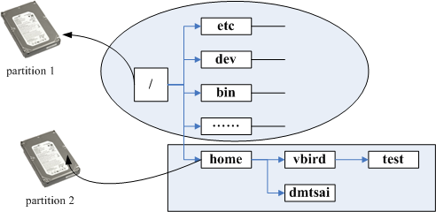

2.1.3 各硬件设备在Linux中的文件名

Linux系统中，每个设备都被当成一个文件来对待” 举例来说，SATA接口的硬盘的文件名称即为/dev/sd[a-d]，其中， 括号内的字母为a-d当中的任意一个，亦即有/dev/sda, /dev/sdb, /dev/sdc, 及 /dev/sdd这四个文件的意思。 
另外先提出来强调一下，在Linux这个系统当中，几乎所有的硬件设备文件都在/dev这个目录内， 所以你会看到/dev/sda, /dev/sr0等等的文件名喔。 

2.2 磁盘分区

2.2.1 磁盘连接的方式与设备文件名的关系

个人计算机常见的磁盘接口有两种， 分别是SATA与SAS接口,正常的实体机器大概使用的都是 /dev/sd[a-] 的磁盘文件名，至于虚拟机环境下面，为了加速，可能就会使用 /dev/vd[a-p] 这种设备文件名喔！ 因此在实际处理你的系统时，可能得要了解为啥会有两种不同磁盘文件名的原因才好！ 
 
例题：假设你的主机为虚拟机，里面仅有一颗VirtIO接口的磁盘，请问他在Linux操作系统里面的设备文件名为何？答：参考 2.1.3 小节的介绍，虚拟机使用 VirtIO 界面时，磁盘文件名应该是 /dev/vda 才对！
 
再以SATA接口来说，由于SATA/USB/SAS等磁盘接口都是使用SCSI模块来驱动的， 因此这些接口的磁盘设备文件名都是/dev/sd[a-p]的格式。 所以SATA/USB接口的磁盘根本就没有一定的顺序，那如何决定他的设备文件名呢？ 这个时候就得要根据Linux核心侦测到磁盘的顺序了！这里以下面的例子来让你了解啰。 
 
例题：如果你的PC上面有两个SATA磁盘以及一个USB磁盘，而主板上面有六个SATA的插槽。这两个SATA磁盘分别安插在主板上的SATA1, SATA5插槽上， 请问这三个磁盘在Linux中的设备文件名为何？答：由于是使用侦测到的顺序来决定设备文件名，并非与实际插槽代号有关，因此设备的文件名如下： 
 
SATA1插槽上的文件名：/dev/sda 
SATA5插槽上的文件名：/dev/sdb 
USB磁盘（开机完成后才被系统捉到）：/dev/sdc 
 
我们在计算机概论谈过磁盘的组成主要有盘片、机械手臂、磁头与主轴马达所组成， 而数据的写入其实是在盘片上面。盘片上面又可细分出扇区（Sector）与磁道（Track）两种单位， 其中扇区的物理量设计有两种大小，分别是 512Bytes 与 4KBytes。假设磁盘只有一个盘片，那么盘片有点像下面这样：

那么是否每个扇区都一样重要呢？其实整颗磁盘的第一个扇区特别的重要，因为他记录了整颗磁盘的重要信息！ 早期磁盘第一个扇区里面含有的重要信息我们称为MBR （Master Boot Record） 格式，但是由于近年来磁盘的容量不断扩大，造成读写上的一些困扰， 甚至有些大于 2TB 以上的磁盘分区已经让某些操作系统无法存取。因此后来又多了一个新的磁盘分区格式，称为 GPT （GUID partition table）！ 这两种分区格式与限制不太相同啦！

2.2.2 MSDOS（MBR） 与 GPT 磁盘分区表（partition table

在前一小节的图示中， 我们有看到“开始与结束磁道”吧？而通常磁盘可能有多个盘片，所有盘片的同一个磁道我们称为柱面 （Cylinder）， 通常那是文件系统的最小单位，也就是分区的最小单位啦！为什么说“通常”呢？因为近来有 GPT 这个可达到 64bit 纪录功能的分区表， 现在我们甚至可以使用扇区 （sector） 号码来作为分区单位哩！厉害了！ 所以说，我们就是利用参考对照柱面或扇区号码的方式来处理啦！

MSDOS （MBR） 分区表格式与限制
早期的 Linux 系统为了相容于 Windows 的磁盘，因此使用的是支持 Windows 的 MBR（Master Boot Record, 主要开机纪录区） 的方式来处理开机管理程序与分区表！而开机管理程序纪录区与分区表则通通放在磁盘的第一个扇区， 这个扇区通常是 512Bytes 的大小 （旧的磁盘扇区都是 512Bytes 喔！），所以说，第一个扇区 512Bytes 会有这两个数据： 
 
• 主要开机记录区（Master Boot Record, MBR）：可以安装开机管理程序的地方，有446 Bytes 
• 分区表（partition table）：记录整颗硬盘分区的状态，有64 Bytes 
 
由于分区表所在区块仅有64 Bytes容量，因此最多仅能有四组记录区，每组记录区记录了该区段的启始与结束的柱面号码。 若将硬盘以长条形来看，然后将柱面以直条图来看，那么那64 Bytes的记录区段有点像下面的图示：

假设上面的硬盘设备文件名为/dev/sda时，那么这四个分区在Linux系统中的设备文件名如下所示， 重点在于文件名后面会再接一个数字，这个数字与该分区所在的位置有关喔！ 
P1:/dev/sda1 
P2:/dev/sda2 
P3:/dev/sda3 
P4:/dev/sda4 
上图中我们假设硬盘只有400个柱面，共分区成为四个分区，第四个分区所在为第301到400号柱面的范围。 当你的操作系统为Windows时，那么第一到第四个分区的代号应该就是C, D, E, F。当你有数据要写入F盘时， 你的数据会被写入这颗磁盘的301~400号柱面之间的意思。 
 
由于分区表就只有64 Bytes而已，最多只能容纳四笔分区的记录， 这四个分区的记录被称为主要（Primary）或延伸（Extended）分区。 根据上面的图示与说明，我们可以得到几个重点信息：
其实所谓的“分区”只是针对那个64 Bytes的分区表进行设置而已！
硬盘默认的分区表仅能写入四组分区信息
这四组分区信息我们称为主要（Primary）或延伸（Extended）分区
分区的最小单位“通常”为柱面（cylinder）
当系统要写入磁盘时，一定会参考磁盘分区表，才能针对某个分区进行数据的处理 
 
既然分区表只有记录四组数据的空间，那么是否代表我一颗硬盘最多只能分区出四个分区？当然不是啦！有经验的朋友都知道， 你可以将一颗硬盘分区成十个以上的分区的！那又是如何达到的呢？在Windows/Linux系统中， 我们是通过刚刚谈到的延伸分区（Extended）的方式来处理的啦！延伸分区的想法是： 既然第一个扇区所在的分区表只能记录四笔数据， 那我可否利用额外的扇区来记录更多的分区信息？实际上图示有点像下面这样：

在上图当中，我们知道硬盘的四个分区记录区仅使用到两个，P1为主要分区，而P2则为延伸分区。请注意， 延伸分区的目的是使用额外的扇区来记录分区信息，延伸分区本身并不能被拿来格式化。 然后我们可以通过延伸分区所指向的那个区块继续作分区的记录。 
 
如上图右下方那个区块有继续分区出五个分区， 这五个由延伸分区继续切出来的分区，就被称为逻辑分区（logical partition）。 同时注意一下，由于逻辑分区是由延伸分区继续分区出来的，所以他可以使用的柱面范围就是延伸分区所设置的范围喔！ 也就是图中的101~400啦！ 
 
同样的，上述的分区在Linux系统中的设备文件名分别如下： 
P1:/dev/sda1 
P2:/dev/sda2 
L1:/dev/sda5 
L2:/dev/sda6 
L3:/dev/sda7 
L4:/dev/sda8 
L5:/dev/sda9 
 
MBR 主要分区、延伸分区与逻辑分区的特性我们作个简单的定义啰：
 
主要分区与延伸分区最多可以有四笔（硬盘的限制）
延伸分区最多只能有一个（操作系统的限制）
逻辑分区是由延伸分区持续切割出来的分区；
能够被格式化后，作为数据存取的分区为主要分区与逻辑分区。延伸分区无法格式化；
逻辑分区的数量依操作系统而不同，在Linux系统中SATA硬盘已经可以突破63个以上的分区限制；
事实上，分区是个很麻烦的东西，因为他是以柱面为单位的“连续”磁盘空间， 且延伸分区又是个类似独立的磁盘空间，所以在分区的时候得要特别注意。我们举下面的例子来解释一下好了：
 
例题：在Windows操作系统当中，如果你想要将D与E盘整合成为一个新的分区，而如果有两种分区的情况如

上图可以整合：因为上图的D与E同属于延伸分区内的逻辑分区，因此只要将两个分区删除，然后再重新创建一个新的分区， 就能够在不影响其他分区的情况下，将两个分区的容量整合成为一个。 
 
下图不可整合：因为D与E分属主分区与逻辑分区，两者不能够整合在一起。除非将延伸分区破坏掉后再重新分区。 但如此一来会影响到所有的逻辑分区，要注意的是：如果延伸分区被破坏，所有逻辑分区将会被删除。 因为逻辑分区的信息都记录在延伸分区里面嘛！
MBR 分区表除了上述的主分区、延伸分区、逻辑分区需要注意之外，由于每组分区表仅有 16Bytes 而已，因此可纪录的信息真的是相当有限的！ 所以，在过去 MBR 分区表的限制中经常可以发现如下的问题：
 
操作系统无法抓取到 2.2T 以上的磁盘容量！
MBR 仅有一个区块，若被破坏后，经常无法或很难救援。
MBR 内的存放开机管理程序的区块仅 446Bytes，无法容纳较多的程序码。

GUID partition table, GPT 磁盘分区表

因为过去一个扇区大小就是 512Bytes 而已，不过目前已经有 4K 的扇区设计出现！为了相容于所有的磁盘，因此在扇区的定义上面， 大多会使用所谓的逻辑区块位址（Logical Block Address, LBA）来处理。GPT 将磁盘所有区块以此 LBA（默认为 512Bytes 喔！） 来规划，而第一个 LBA 称为 LBA0 （从 0 开始编号）。
 
与 MBR 仅使用第一个 512Bytes 区块来纪录不同， GPT 使用了 34 个 LBA 区块来纪录分区信息！同时与过去 MBR 仅有一的区块，被干掉就死光光的情况不同， GPT 除了前面 34 个 LBA 之外，整个磁盘的最后 33 个 LBA 也拿来作为另一个备份！这样或许会比较安全些吧！详细的结构有点像下面的模样：

LBA0 （MBR 相容区块）
 
与 MBR 模式相似的，这个相容区块也分为两个部份，一个就是跟之前 446 Bytes 相似的区块，储存了第一阶段的开机管理程序！ 而在原本的分区表的纪录区内，这个相容模式仅放入一个特殊标志的分区，用来表示此磁盘为 GPT 格式之意。而不懂 GPT 分区表的磁盘管理程序， 就不会认识这颗磁盘，除非用户有特别要求要处理这颗磁盘，否则该管理软件不能修改此分区信息，进一步保护了此磁盘喔！
 
LBA1 （GPT 表头纪录）
 
这个部份纪录了分区表本身的位置与大小，同时纪录了备份用的 GPT 分区 （就是前面谈到的在最后 34 个 LBA 区块） 放置的位置， 同时放置了分区表的检验机制码 （CRC32），操作系统可以根据这个检验码来判断 GPT 是否正确。若有错误，还可以通过这个纪录区来取得备份的 GPT（磁盘最后的那个备份区块） 来恢复 GPT 的正常运行！
 
LBA2-33 （实际纪录分区信息处）
 
从 LBA2 区块开始，每个 LBA 都可以纪录 4 笔分区纪录，所以在默认的情况下，总共可以有 432 = 128 笔分区纪录喔！因为每个 LBA 有 512Bytes，因此每笔纪录用到 128 Bytes 的空间，除了每笔纪录所需要的识别码与相关的纪录之外，GPT 在每笔纪录中分别提供了 64bits 来记载开始/结束的扇区号码，因此，GPT 分区表对於单一分区来说， 他的最大容量限制就会在“ 264 512Bytes = 263 1KBytes = 233TB = 8 ZB ”，要注意 1ZB = 230TB 啦！ 你说有没有够大了？
 
现在 GPT 分区默认可以提供多达 128 笔纪录，而在 Linux 本身的核心设备纪录中，针对单一磁盘来说，虽然过去最多只能到达 15 个分区，不过由于 Linux kernel 通过 udev 等方式的处理，现在 Linux 也已经没有这个限制在了！ 此外，GPT 分区已经没有所谓的主、延伸、逻辑分区的概念，既然每笔纪录都可以独立存在， 当然每个都可以视为是主分区！每一个分区都可以拿来格式化使用喔！

2.2.3 开机流程中的 BIOS 与 UEFI 开机检测程序

基本上，目前的主机系统在载入硬件驱动方面的程序，主要有早期的 BIOS 与新的 UEFI 两种机制，我们分别来谈谈啰！ 
在计算机概论里面我们有谈到那个可爱的BIOS与CMOS两个东西， CMOS是记录各项硬件参数且嵌入在主板上面的储存器，BIOS则是一个写入到主板上的一个固件（再次说明， 固件就是写入到硬件上的一个软件程序）。这个BIOS就是在开机的时候，计算机系统会主动执行的第一个程序了！
 
接下来BIOS会去分析计算机里面有哪些储存设备，我们以硬盘为例，BIOS会依据使用者的设置去取得能够开机的硬盘， 并且到该硬盘里面去读取第一个扇区的MBR位置。 MBR这个仅有446 Bytes的硬盘容量里面会放置最基本的开机管理程序， 此时BIOS就功成圆满，而接下来就是MBR内的开机管理程序的工作了。
 
简单的说，整个开机流程到操作系统之前的动作应该是这样的： 
 
BIOS：开机主动执行的固件，会认识第一个可开机的设备； 
 
MBR：第一个可开机设备的第一个扇区内的主要开机记录区块，内含开机管理程序； 
 
开机管理程序（boot loader）：一支可读取核心文件来执行的软件； 
 
核心文件：开始操作系统的功能... 
第二点要注意，如果你的分区表为 GPT 格式的话，那么 BIOS 也能够从 LBA0 的 MBR 相容区块读取第一阶段的开机管理程序码， 如果你的开机管理程序能够认识 GPT 的话，那么使用 BIOS 同样可以读取到正确的操作系统核心喔！换句话说， 如果开机管理程序不懂 GPT ，例如 Windows XP 的环境，那自然就无法读取核心文件，开机就失败了！
 
Tips 由于 LBA0 仅提供第一阶段的开机管理程序码，因此如果你使用类似 grub 的开机管理程序的话，那么就得要额外分区出一个“ BIOS boot ”的分区， 这个分区才能够放置其他开机过程所需的程序码！在 CentOS 当中，这个分区通常占用 2MB 左右而已。
 
由上面的说明我们会知道，BIOS与MBR都是硬件本身会支持的功能，至于Boot loader则是操作系统安装在MBR上面的一套软件了。由于MBR仅有446 Bytes而已，因此这个开机管理程序是非常小而美的。 这个boot loader的主要任务有下面这些项目： 
 
提供菜单：使用者可以选择不同的开机项目，这也是多重开机的重要功能！ 
 
载入核心文件：直接指向可开机的程序区段来开始操作系统； 
 
转交其他loader：将开机管理功能转交给其他loader负责。 
 
上面前两点还容易理解，但是第三点很有趣喔！那表示你的计算机系统里面可能具有两个以上的开机管理程序呢！ 有可能吗？我们的硬盘不是只有一个MBR而已？是没错啦！但是开机管理程序除了可以安装在MBR之外， 还可以安装在每个分区的开机扇区（boot sector）喔！瞎密？分区还有各别的开机扇区喔？ 没错啊！这个特色才能造就“多重开机”的功能啊！ 
我们举一个例子来说，假设你的个人计算机只有一个硬盘，里面切成四个分区，其中第一、二分区分别安装了Windows及Linux， 你要如何在开机的时候选择用Windows还是Linux开机呢？假设MBR内安装的是可同时认识Windows/Linux操作系统的开机管理程序， 那么整个流程可以图示如下：

在上图中我们可以发现，MBR的开机管理程序提供两个菜单，菜单一（M1）可以直接载入Windows的核心文件来开机； 菜单二（M2）则是将开机管理工作交给第二个分区的开机扇区（boot sector）。当使用者在开机的时候选择菜单二时， 那么整个开机管理工作就会交给第二分区的开机管理程序了。 当第二个开机管理程序启动后，该开机管理程序内（上图中）仅有一个开机菜单，因此就能够使用Linux的核心文件来开机啰。 这就是多重开机的工作情况啦！我们将上图作个总结：
 
每个分区都拥有自己的开机扇区（boot sector） 
图中的系统盘为第一及第二分区， 
实际可开机的核心文件是放置到各分区内的！ 
loader只会认识自己的系统盘内的可开机核心文件，以及其他loader而已； 
loader可直接指向或者是间接将管理权转交给另一个管理程序.

那现在请你想一想，为什么人家常常说：“如果要安装多重开机， 最好先安装Windows再安装Linux”呢？这是因为：

Linux在安装的时候，你可以选择将开机管理程序安装在MBR或各别分区的开机扇区， 而且Linux的loader可以手动设置菜单（就是上图的M1, M2...），所以你可以在Linux的boot loader里面加入Windows开机的选项；

Windows在安装的时候，他的安装程序会主动的覆盖掉MBR以及自己所在分区的开机扇区，你没有选择的机会， 而且他没有让我们自己选择菜单的功能。

因此，如果先安装Linux再安装Windows的话，那MBR的开机管理程序就只会有Windows的项目，而不会有Linux的项目 （因为原本在MBR内的Linux的开机管理程序就会被覆盖掉）。 那需要重新安装Linux一次吗？当然不需要，你只要用尽各种方法来处理MBR的内容即可。 例如利用Linux的救援模式来挽救MBR啊！

UEFI BIOS 搭配 GPT 开机的流程 [2]
我们现在知道 GPT 可以提供到 64bit 的寻址，然后也能够使用较大的区块来处理开机管理程序。但是 BIOS 其实不懂 GPT 耶！还得要通过 GPT 提供相容模式才能够读写这个磁盘设备～而且 BIOS 仅为 16 位的程序，在与现阶段新的操作系统接轨方面有点弱掉了！ 为了解决这个问题，因此就有了 UEFI （Unified Extensible Firmware Interface） 这个统一可延伸固件界面的产生。

UEFI 主要是想要取代 BIOS 这个固件界面，因此我们也称 UEFI 为 UEFI BIOS 就是了。UEFI 使用 C 程序语言，比起使用组合语言的传统 BIOS 要更容易开发！也因为使用 C 语言来撰写，因此如果开发者够厉害，甚至可以在 UEFI 开机阶段就让该系统了解 TCP/IP 而直接上网！ 根本不需要进入操作系统耶！这让小型系统的开发充满各式各样的可能性！

2.2.4 Linux安装模式下，磁盘分区的选择（极重要）

目录树结构 （directory tree）
我们前面有谈过Linux内的所有数据都是以文件的形态来呈现的，所以啰，整个Linux系统最重要的地方就是在于目录树架构。 所谓的目录树架构（directory tree）就是以根目录为主，然后向下呈现分支状的目录结构的一种文件架构。 所以，整个目录树架构最重要的就是那个根目录（root directory），这个根目录的表示方法为一条斜线“/”， 所有的文件都与目录树有关。目录树的呈现方式如下图所示：

如上图所示，所有的文件都是由根目录（/）衍生来的，而次目录之下还能够有其他的数据存在。上图中长方形为目录， 波浪形则为文件。那当我们想要取得mydata那个文件时，系统就得由根目录开始找，然后找到home接下来找到dmtsai， 最终的文件名为：/home/dmtsai/mydata的意思。

文件系统与目录树的关系（挂载）
所谓的“挂载”就是利用一个目录当成进入点，将磁盘分区的数据放置在该目录下； 也就是说，进入该目录就可以读取该分区的意思。这个动作我们称为“挂载”，那个进入点的目录我们称为“挂载点”。 由于整个Linux系统最重要的是根目录，因此根目录一定需要挂载到某个分区的。 至于其他的目录则可依使用者自己的需求来给予挂载到不同的分区。我们以下图来作为一个说明：

 
上图中假设我的硬盘分为两个分区，partition 1是挂载到根目录，至于partition 2则是挂载到/home这个目录。 这也就是说，当我的数据放置在/home内的各次目录时，数据是放置到partition 2的，如果不是放在/home下面的目录， 那么数据就会被放置到partition 1了！

例题：现在让我们来想一想，我的计算机系统如何读取光盘内的数据呢？在Windows里面使用的是“光驱”的代号方式处理（假设为E盘时）， 但在Linux下面我们依旧使用目录树喔！在默认的情况下，Linux是将光驱的数据放置到/media/cdrom里头去的。 如果光盘片里面有个文件文件名为“我的文件”时，那么这个文件是在哪里？答：这个文件最终会在如下的完整文件名中：

Windows： 桌面\我的计算机\E:\我的文件
Linux： /media/cdrom/我的文件

2.3.2 主机硬盘的主要规划

最简单的分区方法： 这个在上面第二节已经谈过了，就是仅分区出根目录与内存交换空间（ / & swap ）即可。 然后再预留一些剩余的磁盘以供后续的练习之用。不过，这当然是不保险的分区方法（所以鸟哥常常说这是“懒人分区法”）！ 因为如果任何一个小细节坏掉（例如坏轨的产生），你的根目录将可能整个的损毁～挽救方面较困难！

稍微麻烦一点的方式： 较麻烦一点的分区方式就是先分析这部主机的未来用途，然后根据用途去分析需要较大容量的目录， 以及读写较为频繁的目录，将这些重要的目录分别独立出来而不与根目录放在一起， 那当这些读写较频繁的磁盘分区有问题时，至少不会影响到根目录的系统数据，那挽救方面就比较容易啊！ 在默认的CentOS环境中，下面的目录是比较符合容量大且（或）读写频繁的目录啰：
/boot 
/ 
/home 
/var 
Swap 