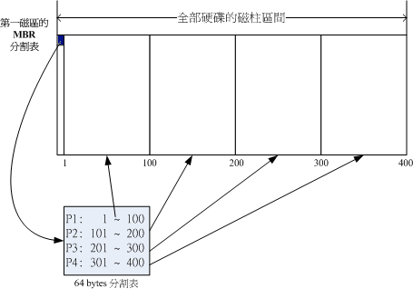
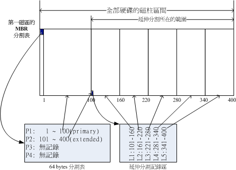

2.1.3 各硬件设备在Linux中的文件名

Linux系统中，每个设备都被当成一个文件来对待” 举例来说，SATA接口的硬盘的文件名称即为/dev/sd[a-d]，其中， 括号内的字母为a-d当中的任意一个，亦即有/dev/sda, /dev/sdb, /dev/sdc, 及 /dev/sdd这四个文件的意思。 
另外先提出来强调一下，在Linux这个系统当中，几乎所有的硬件设备文件都在/dev这个目录内， 所以你会看到/dev/sda, /dev/sr0等等的文件名喔。 

2.2 磁盘分区

2.2.1 磁盘连接的方式与设备文件名的关系

个人计算机常见的磁盘接口有两种， 分别是SATA与SAS接口,正常的实体机器大概使用的都是 /dev/sd[a-] 的磁盘文件名，至于虚拟机环境下面，为了加速，可能就会使用 /dev/vd[a-p] 这种设备文件名喔！ 因此在实际处理你的系统时，可能得要了解为啥会有两种不同磁盘文件名的原因才好！ 
 
例题：假设你的主机为虚拟机，里面仅有一颗VirtIO接口的磁盘，请问他在Linux操作系统里面的设备文件名为何？答：参考 2.1.3 小节的介绍，虚拟机使用 VirtIO 界面时，磁盘文件名应该是 /dev/vda 才对！
 
再以SATA接口来说，由于SATA/USB/SAS等磁盘接口都是使用SCSI模块来驱动的， 因此这些接口的磁盘设备文件名都是/dev/sd[a-p]的格式。 所以SATA/USB接口的磁盘根本就没有一定的顺序，那如何决定他的设备文件名呢？ 这个时候就得要根据Linux核心侦测到磁盘的顺序了！这里以下面的例子来让你了解啰。 
 
例题：如果你的PC上面有两个SATA磁盘以及一个USB磁盘，而主板上面有六个SATA的插槽。这两个SATA磁盘分别安插在主板上的SATA1, SATA5插槽上， 请问这三个磁盘在Linux中的设备文件名为何？答：由于是使用侦测到的顺序来决定设备文件名，并非与实际插槽代号有关，因此设备的文件名如下： 
 
SATA1插槽上的文件名：/dev/sda 
SATA5插槽上的文件名：/dev/sdb 
USB磁盘（开机完成后才被系统捉到）：/dev/sdc 
 
我们在计算机概论谈过磁盘的组成主要有盘片、机械手臂、磁头与主轴马达所组成， 而数据的写入其实是在盘片上面。盘片上面又可细分出扇区（Sector）与磁道（Track）两种单位， 其中扇区的物理量设计有两种大小，分别是 512Bytes 与 4KBytes。假设磁盘只有一个盘片，那么盘片有点像下面这样：

那么是否每个扇区都一样重要呢？其实整颗磁盘的第一个扇区特别的重要，因为他记录了整颗磁盘的重要信息！ 早期磁盘第一个扇区里面含有的重要信息我们称为MBR （Master Boot Record） 格式，但是由于近年来磁盘的容量不断扩大，造成读写上的一些困扰， 甚至有些大于 2TB 以上的磁盘分区已经让某些操作系统无法存取。因此后来又多了一个新的磁盘分区格式，称为 GPT （GUID partition table）！ 这两种分区格式与限制不太相同啦！

2.2.2 MSDOS（MBR） 与 GPT 磁盘分区表（partition table

在前一小节的图示中， 我们有看到“开始与结束磁道”吧？而通常磁盘可能有多个盘片，所有盘片的同一个磁道我们称为柱面 （Cylinder）， 通常那是文件系统的最小单位，也就是分区的最小单位啦！为什么说“通常”呢？因为近来有 GPT 这个可达到 64bit 纪录功能的分区表， 现在我们甚至可以使用扇区 （sector） 号码来作为分区单位哩！厉害了！ 所以说，我们就是利用参考对照柱面或扇区号码的方式来处理啦！

MSDOS （MBR） 分区表格式与限制
早期的 Linux 系统为了相容于 Windows 的磁盘，因此使用的是支持 Windows 的 MBR（Master Boot Record, 主要开机纪录区） 的方式来处理开机管理程序与分区表！而开机管理程序纪录区与分区表则通通放在磁盘的第一个扇区， 这个扇区通常是 512Bytes 的大小 （旧的磁盘扇区都是 512Bytes 喔！），所以说，第一个扇区 512Bytes 会有这两个数据： 
 
• 主要开机记录区（Master Boot Record, MBR）：可以安装开机管理程序的地方，有446 Bytes 
• 分区表（partition table）：记录整颗硬盘分区的状态，有64 Bytes 
 
由于分区表所在区块仅有64 Bytes容量，因此最多仅能有四组记录区，每组记录区记录了该区段的启始与结束的柱面号码。 若将硬盘以长条形来看，然后将柱面以直条图来看，那么那64 Bytes的记录区段有点像下面的图示：

假设上面的硬盘设备文件名为/dev/sda时，那么这四个分区在Linux系统中的设备文件名如下所示， 重点在于文件名后面会再接一个数字，这个数字与该分区所在的位置有关喔！ 
P1:/dev/sda1 
P2:/dev/sda2 
P3:/dev/sda3 
P4:/dev/sda4 
上图中我们假设硬盘只有400个柱面，共分区成为四个分区，第四个分区所在为第301到400号柱面的范围。 当你的操作系统为Windows时，那么第一到第四个分区的代号应该就是C, D, E, F。当你有数据要写入F盘时， 你的数据会被写入这颗磁盘的301~400号柱面之间的意思。 
 
由于分区表就只有64 Bytes而已，最多只能容纳四笔分区的记录， 这四个分区的记录被称为主要（Primary）或延伸（Extended）分区。 根据上面的图示与说明，我们可以得到几个重点信息：
其实所谓的“分区”只是针对那个64 Bytes的分区表进行设置而已！
硬盘默认的分区表仅能写入四组分区信息
这四组分区信息我们称为主要（Primary）或延伸（Extended）分区
分区的最小单位“通常”为柱面（cylinder）
当系统要写入磁盘时，一定会参考磁盘分区表，才能针对某个分区进行数据的处理 
 
既然分区表只有记录四组数据的空间，那么是否代表我一颗硬盘最多只能分区出四个分区？当然不是啦！有经验的朋友都知道， 你可以将一颗硬盘分区成十个以上的分区的！那又是如何达到的呢？在Windows/Linux系统中， 我们是通过刚刚谈到的延伸分区（Extended）的方式来处理的啦！延伸分区的想法是： 既然第一个扇区所在的分区表只能记录四笔数据， 那我可否利用额外的扇区来记录更多的分区信息？实际上图示有点像下面这样：

在上图当中，我们知道硬盘的四个分区记录区仅使用到两个，P1为主要分区，而P2则为延伸分区。请注意， 延伸分区的目的是使用额外的扇区来记录分区信息，延伸分区本身并不能被拿来格式化。 然后我们可以通过延伸分区所指向的那个区块继续作分区的记录。 
 
如上图右下方那个区块有继续分区出五个分区， 这五个由延伸分区继续切出来的分区，就被称为逻辑分区（logical partition）。 同时注意一下，由于逻辑分区是由延伸分区继续分区出来的，所以他可以使用的柱面范围就是延伸分区所设置的范围喔！ 也就是图中的101~400啦！ 
 
同样的，上述的分区在Linux系统中的设备文件名分别如下： 
P1:/dev/sda1 
P2:/dev/sda2 
L1:/dev/sda5 
L2:/dev/sda6 
L3:/dev/sda7 
L4:/dev/sda8 
L5:/dev/sda9 
 
MBR 主要分区、延伸分区与逻辑分区的特性我们作个简单的定义啰：
 
主要分区与延伸分区最多可以有四笔（硬盘的限制）
延伸分区最多只能有一个（操作系统的限制）
逻辑分区是由延伸分区持续切割出来的分区；
能够被格式化后，作为数据存取的分区为主要分区与逻辑分区。延伸分区无法格式化；
逻辑分区的数量依操作系统而不同，在Linux系统中SATA硬盘已经可以突破63个以上的分区限制；
事实上，分区是个很麻烦的东西，因为他是以柱面为单位的“连续”磁盘空间， 且延伸分区又是个类似独立的磁盘空间，所以在分区的时候得要特别注意。我们举下面的例子来解释一下好了：
 
例题：在Windows操作系统当中，如果你想要将D与E盘整合成为一个新的分区，而如果有两种分区的情况如

