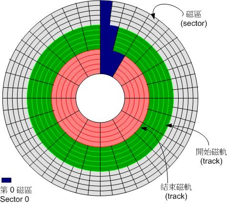

2.1.3 各硬件设备在Linux中的文件名

Linux系统中，每个设备都被当成一个文件来对待” 举例来说，SATA接口的硬盘的文件名称即为/dev/sd[a-d]，其中， 括号内的字母为a-d当中的任意一个，亦即有/dev/sda, /dev/sdb, /dev/sdc, 及 /dev/sdd这四个文件的意思。 
另外先提出来强调一下，在Linux这个系统当中，几乎所有的硬件设备文件都在/dev这个目录内， 所以你会看到/dev/sda, /dev/sr0等等的文件名喔。 

2.2 磁盘分区

2.2.1 磁盘连接的方式与设备文件名的关系

个人计算机常见的磁盘接口有两种， 分别是SATA与SAS接口,正常的实体机器大概使用的都是 /dev/sd[a-] 的磁盘文件名，至于虚拟机环境下面，为了加速，可能就会使用 /dev/vd[a-p] 这种设备文件名喔！ 因此在实际处理你的系统时，可能得要了解为啥会有两种不同磁盘文件名的原因才好！ 
 
例题：假设你的主机为虚拟机，里面仅有一颗VirtIO接口的磁盘，请问他在Linux操作系统里面的设备文件名为何？答：参考 2.1.3 小节的介绍，虚拟机使用 VirtIO 界面时，磁盘文件名应该是 /dev/vda 才对！
 
再以SATA接口来说，由于SATA/USB/SAS等磁盘接口都是使用SCSI模块来驱动的， 因此这些接口的磁盘设备文件名都是/dev/sd[a-p]的格式。 所以SATA/USB接口的磁盘根本就没有一定的顺序，那如何决定他的设备文件名呢？ 这个时候就得要根据Linux核心侦测到磁盘的顺序了！这里以下面的例子来让你了解啰。 
 
例题：如果你的PC上面有两个SATA磁盘以及一个USB磁盘，而主板上面有六个SATA的插槽。这两个SATA磁盘分别安插在主板上的SATA1, SATA5插槽上， 请问这三个磁盘在Linux中的设备文件名为何？答：由于是使用侦测到的顺序来决定设备文件名，并非与实际插槽代号有关，因此设备的文件名如下： 
 
SATA1插槽上的文件名：/dev/sda 
SATA5插槽上的文件名：/dev/sdb 
USB磁盘（开机完成后才被系统捉到）：/dev/sdc 
 
我们在计算机概论谈过磁盘的组成主要有盘片、机械手臂、磁头与主轴马达所组成， 而数据的写入其实是在盘片上面。盘片上面又可细分出扇区（Sector）与磁道（Track）两种单位， 其中扇区的物理量设计有两种大小，分别是 512Bytes 与 4KBytes。假设磁盘只有一个盘片，那么盘片有点像下面这样：

