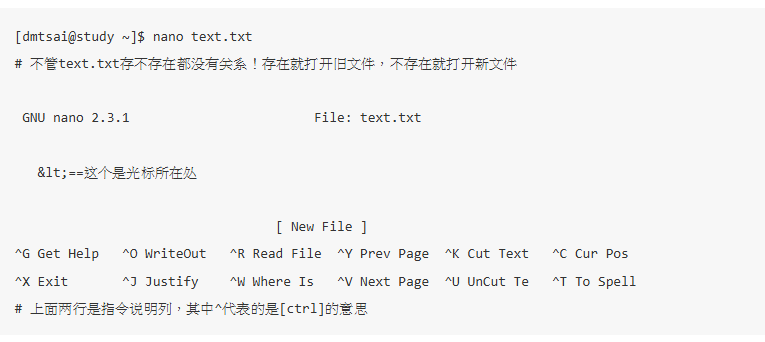

# 第四章

## 4.2.1 开始下达指令
其实整个指令下达的方式很简单，你只要记得几个重要的概念就可以了。举例来说，你可以这样下达指令的：
[dmtsai@study ~]$ command  [-options]  parameter1  parameter2 ..  
指令     选项        参数（1）     参数（2）
1. 一行指令中第一个输入的部分绝对是“指令（command）”或“可可执行文件案（例如批次脚本,script）”
2. command 为指令的名称，例如变换工作目录的指令为 cd 等等；
3. 中刮号[]并不存在于实际的指令中，而加入选项设置时，通常选项前会带 - 号，例如 -h；有时候会使用选项的完整全名，则选项前带有 -- 符号，例如 --help；
4. parameter1 parameter2.. 为依附在选项后面的参数，或者是 command 的参数；
5. 指令, 选项, 参数等这几个咚咚中间以空格来区分，不论空几格 shell 都视为一格。所以空格是很重要的特殊字符！；
6. 按下[Enter]按键后，该指令就立即执行。[Enter]按键代表着一行指令的开始启动。
7. 指令太长的时候，可以使用反斜线 （\） 来跳脱[Enter]符号，使指令连续到下一行。注意！反斜线后就立刻接特殊字符，才能跳脱！
8. 其他：
    1. 在 Linux 系统中，英文大小写字母是不一样的。举例来说， cd 与 CD 并不同。
    2. 更多的介绍等到第十章 bash 时，再来详述。

##  4.2.2 基础指令的操作
下面我们立刻来操作几个简单的指令看看啰！同时请注意，我们已经使用了英文语系作为默认输出的语言喔！

显示日期与时间的指令： date
 
显示日历的指令： cal
 
简单好用的计算机： bc

1. 显示日期的指令： date

如果在命令行中想要知道目前Linux系统的时间，那么就直接在命令行界面输入date即可显示：

[dmtsai@study ~]$ date
Fri May 29 14:32:01 CST 2015
上面显示的是：星期五, 五月二十九日, 14:32 分, 01秒，在 2015 年的 CST 时区！台湾在CST时区中啦！ 请赶快动手做做看呦！好了，那么如果我想要让这个程序显示出“2015/05/29”这样的日期显示方式呢？ 那么就使用date的格式化输出功能吧！

[dmtsai@study ~]$ date +%Y/%m/%d 
2015/05/29 
 
[dmtsai@study ~]$ date +%H:%M 
14:33 
 
那个“+%Y%m%d”就是date指令的一些参数功能啦！很好玩吧！那你问我， 鸟哥怎么知道这些参数的啊？要背起来吗？当然不必啦！下面再告诉你怎么查这些参数啰！

从上面的例子当中我们也可以知道，指令之后的选项除了前面带有减号“-”之外，某些特殊情况下， 选项或参数前面也会带有正号“+”的情况！这部份可不要轻易的忘记了呢！

## 4.2.3 重要的几个热键[Tab], [ctrl]-c, [ctrl]-d
[Tab]按键
[Tab]按键就是在键盘的大写灯切换按键（[Caps Lock]）上面的那个按键！在各种Unix-Like的Shell当中， 这个[Tab]按键算是Linux的Bash shell最棒的功能之一了！他具有“命令补全”与“文件补齐”的功能喔！ 重点是，可以避免我们打错指令或文件名称呢！很棒吧！但是[Tab]按键在不同的地方输入，会有不一样的结果喔！ 我们举下面的例子来说明。上一小节我们不是提到 cal 这个指令吗？如果我在命令行输入 ca 再按两次 [tab] 按键， 会出现什么讯息？

发现什么事？所有以ca为开头的指令都被显示出来啦！很不错吧！那如果你输入“ls -al ~/.bash”再加两个[tab]会出现什么？

在该目录下面所有以 .bash 为开头的文件名称都会被显示出来了呢！注意看上面两个例子喔， 我们按[tab]按键的地方如果是在command（第一个输入的数据）后面时，他就代表着 “命令补全”，如果是接在第二个字以后的，就会变成“文件补齐”的功能了！但是在某些特殊的指令下面，文件补齐的功能可能会变成“参数/选项补齐”喔！ 我们同样使用 date 这个指令来查一下：

# 4.3 Linux系统的线上求助man page与info page
## 4.3.1 指令的 --help 求助说明
事实上，几乎 Linux 上面的指令，在开发的时候，开发者就将可以使用的指令语法与参数写入指令操作过程中了！你只要使用“ --help ”这个选项， 就能够将该指令的用法作一个大致的理解喔！举例来说，我们来瞧瞧 date 这个指令的基本用法与选项参数的介绍：

看一下上面的显示，首先一开始是下达语法的方式 （Usage），这个 date 有两种基本语法，一种是直接下达并且取得日期回传值，且可以 +FORAMAT 的方式来显示。 至于另一种方式，则是加上 MMDDhhmmCCYY 的方式来设置日期时间。他的格式是“月月日日时时分分西元年”的格式！再往下看， 会说明主要的选项，例如 -d 的意义等等，后续又会出现 +FORMAT 的用法！从里面你可以查到我们之前曾经用过得“ date +%Y%m%d ”这个指令与选项的说明。
同样的，通过 cal --help 你也可以取得相同的解释！相当好用！不过，如果你使用 bc --help 的话，虽然也有简单的解释，但是就没有类似 scale 的用法说明， 同时也不会有 +, -, *, /, % 等运算子的说明了！因此，虽然 --help 已经相当好用，不过，通常 --help 用在协助你查询“你曾经用过的指令所具备的选项与参数”而已， 如果你要使用的是从来没有用过得指令，或者是你要查询的根本就不是指令，而是文件的“格式”时，那就得要通过 man page 啰！！

## 4.3.2 man page
咦！date --help 没有告诉你 STRING 是什么？嘿嘿！不要担心，除了 --help 之外，我们Linux上面的其他线上求助系统已经都帮你想好要怎么办了， 所以你只要使用简单的方法去寻找一下说明的内容，马上就清清楚楚的知道该指令的用法了！怎么看呢？就是找男人（man） 呀！喔！不是啦！这个man是manual（操作说明）的简写啦！只要下达：“man date” 马上就会有清楚的说明出现在你面前喔！如下所示：

Tips 进入man指令的功能后，你可以按下“空白键”往下翻页，可以按下“ q ”按键来离开man的环境。 更多在man指令下的功能，本小节后面会谈到的！

看（鸟哥没骂人！）马上就知道一大堆的用法了！如此一来，不就可以知道date的相关选项与参数了吗？真方便！ 而出现的这个屏幕画面，我们称呼他为man page， 你可以在里头查询他的用法与相关的参数说明。如果仔细一点来看这个man page的话，你会发现几个有趣的东西。

首先，在上个表格的第一行，你可以看到的是：“DATE（1）”，DATE我们知道是指令的名称， 那么（1）代表什么呢？他代表的是“一般使用者可使用的指令”的意思！咦！还有这个用意啊！呵呵！ 没错～在查询数据的后面的数字是有意义的喔！他可以帮助我们了解或者是直接查询相关的数据。 常见的几个数字的意义是这样的：

表中的1, 5, 8这三个号码特别重要，也请读者要将这三个数字所代表的意义背下来喔！

再来，man page的内容也分成好几个部分来加以介绍该指令呢！就是上头man date那个表格内， 以NAME作为开始介绍，最后还有个SEE ALSO来作为结束。基本上，man page大致分成下面这几个部分：

首先， 如果要向下翻页的话，可以按下键盘的空白键，也可以使用[Page Up]与[Page Down]来翻页呢！同时，如果你知道某些关键字的话， 那么可以在任何时候输入“/word”，来主动搜寻关键字！例如在上面的搜寻当中，我输入了“/date”会变成怎样？
当你按下“/”之后，光标就会移动到屏幕的最下面一行， 并等待你输入搜寻的字串了。此时，输入date后，man page就会开始搜寻跟date有关的字串， 并且移动到该区域呢！很方便吧！最后，如果要离开man page时，直接按下“ q ”就能够离开了。 我们将一些在man page常用的按键给他整理整理：

既然有man page，自然就是因为有一些文件数据，所以才能够以man page读出来啰！那么这些man page的数据 放在哪里呢？不同的distribution通常可能有点差异性，不过，通常是放在/usr/share/man这个目录里头，然而，我们可以通过修改他的man page搜寻路径来改善这个目录的问题！修改/etc/man_db.conf （有的版本为man.conf或manpath.conf或man.config等）即可啰！

在某些情况下，你可能知道要使用某些特定的指令或者是修改某些特定的配置文件，但是偏偏忘记了该指令的完整名称。 有些时候则是你只记得该指令的部分关键字。这个时候你要如何查出来你所想要知道的man page呢？ 我们以下面的几个例子来说明man这个指令有用的地方喔！

例题：你可否查出来，系统中还有哪些跟“man”这个指令有关的说明文档呢？答：你可以使用下面的指令来查询一下：

使用 -f 这个选项就可以取得更多与man相关的信息，而上面这个结果当中也有提示了 （数字） 的内容， 举例来说，第三行的“ man （7） ”表示有个man （7）的说明文档存在喔！但是却有个man （1）存在啊！ 那当我们下达“ man man ”的时候，到底是找到哪一个说明文档呢？ 其实，你可以指定不同的文件的，举例来说，上表当中的两个 man 你可以这样将他的文件叫出来：

你可以自行将上面两个指令输入一次看看，就知道，两个指令输出的结果是不同的。 那个1, 7就是分别取出在man page里面关于1与7相关数据的文件文件啰！ 好了，那么万一我真的忘记了下达数字，只有输入“ man man ”时，那么取出的数据到底是1还是7啊？ 这个就跟搜寻的顺序有关了。搜寻的顺序是记录在/etc/man_db.conf 这个配置文件当中， 先搜寻到的那个说明文档，就会先被显示出来！ 一般来说，通常会先找到数字较小的那个啦！因为排序的关系啊！所以， man man 会跟 man 1 man 结果相同！

左边部分：指令（或文件）以及该指令所代表的意义（就是那个数字）； 
右边部分：这个指令的简易说明，例如上述的“-macros to format man pages”

当使用“man -f 指令”时，man只会找数据中的左边那个指令（或文件）的完整名称，有一点不同都不行！ 但如果我想要找的是“关键字”呢？也就是说，我想要同时找上面说的两个地方的内容，只要该内容有关键字存在， 不需要完全相同的指令（或文件）就能够找到时，该怎么办？请看下个范例啰！

举例来说，打印的相关指令，鸟哥其实仅记得 lp （line print）而已。那我就由 man lp 开始，去找相关的说明， 然后，再以 lp[tab][tab] 找到任何以 lp 为开头的指令，找到我认为可能有点相关的指令后，先以 --help 去查基本的用法， 若有需要再以 man 去查询指令的用法！

## 4.3.3 info page

在所有的Unix Like系统当中，都可以利用 man 来查询指令或者是相关文件的用法； 但是，在Linux里面则又额外提供了一种线上求助的方法，那就是利用info这个好用的家伙啦！

基本上，info与man的用途其实差不多，都是用来查询指令的用法或者是文件的格式。但是与man page一口气输出一堆信息不同的是，info page则是将文件数据拆成一个一个的段落，每个段落用自己的页面来撰写， 并且在各个页面中还有类似网页的“超链接”来跳到各不同的页面中，每个独立的页面也被称为一个节点（node）。 所以，你可以将info page想成是文字模式的网页显示数据啦！

不过你要查询的目标数据的说明文档必须要以info的格式来写成才能够使用info的特殊功能（例如超链接）。 而这个支持info指令的文件默认是放置在/usr/share/info/这个目录当中的。 举例来说，info这个指令的说明文档有写成info格式，所以，你使用“ info info ”可以得到如下的画面：

File：代表这个info page的数据是来自info.info文件所提供的； 
Node：代表目前的这个页面是属于Top节点。 意思是info.info内含有很多信息，而Top仅是info.info文件内的一个节点内容而已； 
Next：下一个节点的名称为Getting Started，你也可以按“N”到下个节点去； 
Up：回到上一层的节点总揽画面，你也可以按下“U”回到上一层； 
Prev：前一个节点。但由于Top是info.info的第一个节点，所以上面没有前一个节点的信息。

从第一行你可以知道这个节点的内容、来源与相关链接的信息。更有用的信息是，你可以通过直接按下N, P, U来去到下一个、上一个与上一层的节点（node）！非常的方便！ 第一行之后就是针对这个节点的说明。在上表的范例中，第二行以后的说明就是针对info.info内的Top这个节点所做的。 另外，如论你在任何一个页面，只要不知道怎么使用 info 了，直接按下 h 系统就能够提供一些基本按键功能的介绍喔！

如同上图所示，info的说明文档将内容分成多个node，并且每个node都有定位与链接。 在各链接之间还可以具有类似“超链接”的快速按钮，可以通过[tab]键在各个超链接间移动。 也可以使用U,P,N来在各个阶层与相关链接中显示！非常的不错用啦！ 至于在info page当中可以使用的按键，可以整理成下面这样，事实上，你也可以在 info page 中按下 h 喔！

## 4.4 超简单文书编辑器： nano
nano的使用其实很简单，你可以直接加上文件名就能够打开一个旧文件或新文件！下面我们就来打开一个名为text.txt的文件名来看看：

 

 
如上图所示，你可以看到第一行反白的部分，那仅是在宣告nano的版本与文件名（File: text.txt）而已。 之后你会看到最下面的三行，分别是文件的状态（New File）与两行指令说明列。指令说明列反白的部分就是组合键， 接的则是该组合键的功能。那个指数符号（^）代表的是键盘的[Ctrl]按键啦！下面先来说说比较重要的几个组合按键：
[ctrl]-G：取得线上说明（help），很有用的！ 
[ctrl]-X：离开naon软件，若有修改过文件会提示是否需要储存喔！ 
[ctrl]-O：储存盘案，若你有权限的话就能够储存盘案了； 
[ctrl]-R：从其他文件读入数据，可以将某个文件的内容贴在本文件中； 
[ctrl]-W：搜寻字串，这个也是很有帮助的指令喔！ 
[ctrl]-C：说明目前光标所在处的行数与列数等信息； 
[ctrl]-_：可以直接输入行号，让光标快速移动到该行； 
[alt]-Y：校正语法功能打开或关闭（按一下开、再按一下关） 
[alt]-M：可以支持鼠标来移动光标的功能

Linux关机方式
所以下面我们就来谈一谈几个与关机/重新开机相关的指令啰！
 
将数据同步写入硬盘中的指令： sync 
惯用的关机指令： shutdown 
重新开机，关机： reboot, halt, poweroff