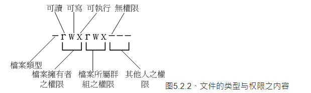

## 5.1 使用者与群组

重要概念： 使用者，群组，非群组外的其他人 

1.文件拥有者 
初次接触Linux的朋友大概会觉得很怪异，怎么“Linux有这么多使用者， 还分什么群组，有什么用？”。这个“使用者与群组”的功能可是相当健全而好用的一个安全防护呢！怎么说呢？ 由于Linux是个多用户多任务的系统，因此可能常常会有多人同时使用这部主机来进行工作的情况发生， 为了考虑每个人的隐私权以及每个人喜好的工作环境，因此，这个“文件拥有者”的角色就显的相当的重要了！

例如当你将你的e-mail情书转存成文件之后，放在你自己的主文件夹，你总不希望被其他人看见自己的情书吧？ 这个时候，你就把该文件设置成“只有文件拥有者，就是我，才能看与修改这个文件的内容”， 那么即使其他人知道你有这个相当“有趣”的文件，不过由于你有设置适当的权限， 所以其他人自然也就无法知道该文件的内容啰！ 

2.群组概念

那么群组呢？为何要设置文件还有所属的群组？其实，群组最有用的功能之一，就是当你在团队开发资源的时候啦！ 举例来说，假设有两组专题生在我的主机里面，第一个专题组别为projecta，里面的成员有 class1, class2, class3三个；第二个专题组别为projectb，里面的成员有class4, class5, class6。 这两个专题之间是有竞争性质的，但却要缴交同一份报告。每组的组员之间必须要能够互相修改对方的数据， 但是其他组的组员则不能看到本组自己的文件内容，此时该如何是好？

在Linux下面这样的限制是很简单啦！我可以经由简易的文件权限设置，就能限制非自己团队（亦即是群组啰） 的其他人不能够阅览内容啰！而且亦可以让自己的团队成员可以修改我所创建的文件！ 同时，如果我自己还有私人隐密的文件，仍然可以设置成让自己的团队成员也看不到我的文件数据。 很方便吧！

另外，如果teacher这个帐号是projecta与projectb这两个专题的老师， 他想要同时观察两者的进度，因此需要能够进入这两个群组的权限时，你可以设置teacher这个帐号， “同时支持projecta与projectb这两个群组！”，也就是说：每个帐号都可以有多个群组的支持呢！

这样说或许你还不容易理解这个使用者与群组的关系吧？没关系，我们可以使用目前“家庭”的观念来进行解说喔！ 假设有一家人，家里只有三兄弟，分别是王大毛、王二毛与王三毛三个人， 而这个家庭是登记在王大毛的名下的！所以，“王大毛家有三个人，分别是王大毛、王二毛与王三毛”， 而且这三个人都有自己的房间，并且共同拥有一个客厅喔！

使用者的意义：由于王家三人各自拥有自己的房间，所以， 王二毛虽然可以进入王三毛的房间，但是二毛不能翻三毛的抽屉喔！那样会被三毛K的！ 因为抽屉里面可能有三毛自己私人的东西，例如情书啦，日记啦等等的，这是“私人的空间”，所以当然不能让二毛拿啰！

群组的概念：由于共同拥有客厅，所以王家三兄弟可以在客厅打开电视机啦、 翻阅报纸啦、坐在沙发上面发呆啦等等的！ 反正，只要是在客厅的玩意儿，三兄弟都可以使用喔！ 因为大家都是一家人嘛！

这样说来应该有点晓得了喔！那个“王大毛家”就是所谓的“群组”啰， 至于三兄弟就是分别为三个“使用者”，而这三个使用者是在同一个群组里面的喔！ 而三个使用者虽然在同一群组内，但是我们可以设置“权限”， 好让某些使用者个人的信息不被群组的拥有者查询，以保有个人“私人的空间”啦！ 而设置群组共享，则可让大家共同分享喔！

3.其他人的概念

好了，那么今天又有个人，叫做张小猪，他是张小猪家的人，与王家没有关系啦！ 这个时候，除非王家认识张小猪，然后开门让张小猪进来王家，否则张小猪永远没有办法进入王家， 更不要说进到王三毛的房间啦！不过，如果张小猪通过关系认识了三毛，并且跟王三毛成为好朋友， 那么张小猪就可以通过三毛进入王家啦！呵呵！没错！那个张小猪就是所谓的“其他人，Others”啰！

因此，我们就可以知道啦，在Linux里面，任何一个文件都具有“User, Group及Others”三种身份的个别权限， 我们可以将上面的说明以下面的图示来解释：

Linux 使用者身份与群组记录的文件
在我们Linux系统当中，默认的情况下，所有的系统上的帐号与一般身份使用者，还有那个root的相关信息， 都是记录在/etc/passwd这个文件内的。至于个人的密码则是记录在/etc/shadow这个文件下。 此外，Linux所有的群组名称都纪录在/etc/group内！这三个文件可以说是Linux系统里面帐号、密码、群组信息的集中地啰！ 不要随便删除这三个文件啊！ ^_^

## 5.2 Linux 文件权限的概念

### 5.2.1 Linux文件属性
使用sudo切换为root权限

 

ls是“list”的意思，重点在显示文件的文件名与相关属性。而选项“-al”则表示列出所有的文件详细的权限与属性 （包含隐藏文件，就是文件名第一个字符为“ . ”的文件）。如上所示，在你第一次以root身份登陆Linux时， 如果你输入上述指令后，应该有上列的几个东西，先解释一下上面七个字段个别的意思：

第一栏代表这个文件的类型与权限（permission）：
这个地方最需要注意了！仔细看的话，你应该可以发现这一栏其实共有十个字符：

第一个字符代表这个文件是“目录、文件或链接文件等等”：
当为[ d ]则是目录，例如上表文件名为“.config”的那一行；
当为[ - ]则是文件，例如上表文件名为“initial-setup-ks.cfg”那一行；
若是[ l ]则表示为链接文件（link file）；
若是[ b ]则表示为设备文件里面的可供储存的周边设备（可随机存取设备）；
若是[ c ]则表示为设备文件里面的序列埠设备，例如键盘、鼠标（一次性读取设备）。