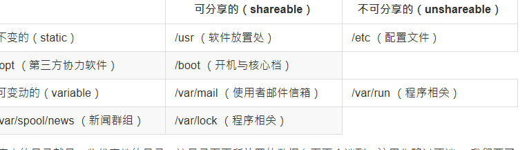
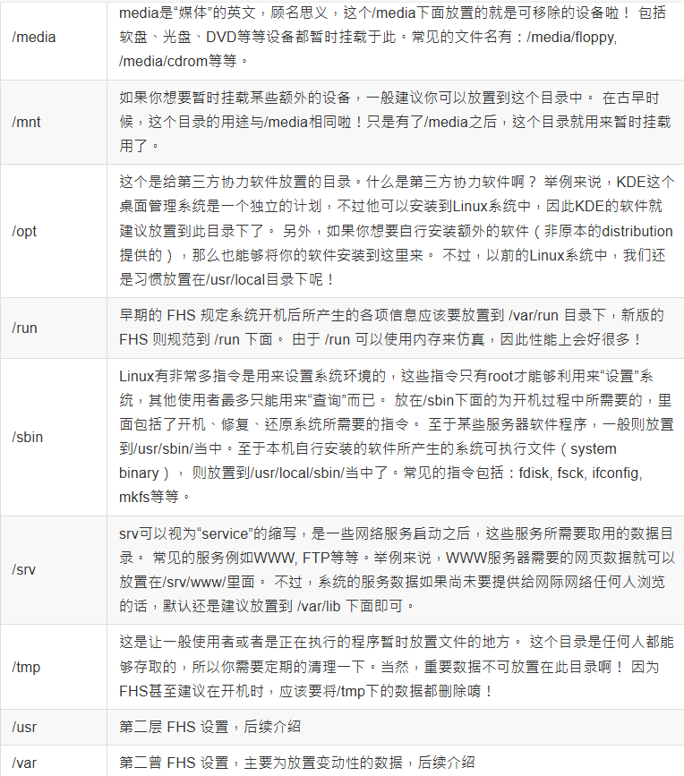

## 5.1 使用者与群组

重要概念： 使用者，群组，非群组外的其他人 

1.文件拥有者 
初次接触Linux的朋友大概会觉得很怪异，怎么“Linux有这么多使用者， 还分什么群组，有什么用？”。这个“使用者与群组”的功能可是相当健全而好用的一个安全防护呢！怎么说呢？ 由于Linux是个多用户多任务的系统，因此可能常常会有多人同时使用这部主机来进行工作的情况发生， 为了考虑每个人的隐私权以及每个人喜好的工作环境，因此，这个“文件拥有者”的角色就显的相当的重要了！

例如当你将你的e-mail情书转存成文件之后，放在你自己的主文件夹，你总不希望被其他人看见自己的情书吧？ 这个时候，你就把该文件设置成“只有文件拥有者，就是我，才能看与修改这个文件的内容”， 那么即使其他人知道你有这个相当“有趣”的文件，不过由于你有设置适当的权限， 所以其他人自然也就无法知道该文件的内容啰！ 

2.群组概念

那么群组呢？为何要设置文件还有所属的群组？其实，群组最有用的功能之一，就是当你在团队开发资源的时候啦！ 举例来说，假设有两组专题生在我的主机里面，第一个专题组别为projecta，里面的成员有 class1, class2, class3三个；第二个专题组别为projectb，里面的成员有class4, class5, class6。 这两个专题之间是有竞争性质的，但却要缴交同一份报告。每组的组员之间必须要能够互相修改对方的数据， 但是其他组的组员则不能看到本组自己的文件内容，此时该如何是好？

在Linux下面这样的限制是很简单啦！我可以经由简易的文件权限设置，就能限制非自己团队（亦即是群组啰） 的其他人不能够阅览内容啰！而且亦可以让自己的团队成员可以修改我所创建的文件！ 同时，如果我自己还有私人隐密的文件，仍然可以设置成让自己的团队成员也看不到我的文件数据。 很方便吧！

另外，如果teacher这个帐号是projecta与projectb这两个专题的老师， 他想要同时观察两者的进度，因此需要能够进入这两个群组的权限时，你可以设置teacher这个帐号， “同时支持projecta与projectb这两个群组！”，也就是说：每个帐号都可以有多个群组的支持呢！

这样说或许你还不容易理解这个使用者与群组的关系吧？没关系，我们可以使用目前“家庭”的观念来进行解说喔！ 假设有一家人，家里只有三兄弟，分别是王大毛、王二毛与王三毛三个人， 而这个家庭是登记在王大毛的名下的！所以，“王大毛家有三个人，分别是王大毛、王二毛与王三毛”， 而且这三个人都有自己的房间，并且共同拥有一个客厅喔！

使用者的意义：由于王家三人各自拥有自己的房间，所以， 王二毛虽然可以进入王三毛的房间，但是二毛不能翻三毛的抽屉喔！那样会被三毛K的！ 因为抽屉里面可能有三毛自己私人的东西，例如情书啦，日记啦等等的，这是“私人的空间”，所以当然不能让二毛拿啰！

群组的概念：由于共同拥有客厅，所以王家三兄弟可以在客厅打开电视机啦、 翻阅报纸啦、坐在沙发上面发呆啦等等的！ 反正，只要是在客厅的玩意儿，三兄弟都可以使用喔！ 因为大家都是一家人嘛！

这样说来应该有点晓得了喔！那个“王大毛家”就是所谓的“群组”啰， 至于三兄弟就是分别为三个“使用者”，而这三个使用者是在同一个群组里面的喔！ 而三个使用者虽然在同一群组内，但是我们可以设置“权限”， 好让某些使用者个人的信息不被群组的拥有者查询，以保有个人“私人的空间”啦！ 而设置群组共享，则可让大家共同分享喔！

3.其他人的概念

好了，那么今天又有个人，叫做张小猪，他是张小猪家的人，与王家没有关系啦！ 这个时候，除非王家认识张小猪，然后开门让张小猪进来王家，否则张小猪永远没有办法进入王家， 更不要说进到王三毛的房间啦！不过，如果张小猪通过关系认识了三毛，并且跟王三毛成为好朋友， 那么张小猪就可以通过三毛进入王家啦！呵呵！没错！那个张小猪就是所谓的“其他人，Others”啰！

因此，我们就可以知道啦，在Linux里面，任何一个文件都具有“User, Group及Others”三种身份的个别权限， 我们可以将上面的说明以下面的图示来解释：

Linux 使用者身份与群组记录的文件
在我们Linux系统当中，默认的情况下，所有的系统上的帐号与一般身份使用者，还有那个root的相关信息， 都是记录在/etc/passwd这个文件内的。至于个人的密码则是记录在/etc/shadow这个文件下。 此外，Linux所有的群组名称都纪录在/etc/group内！这三个文件可以说是Linux系统里面帐号、密码、群组信息的集中地啰！ 不要随便删除这三个文件啊！ ^_^

## 5.2 Linux 文件权限的概念

### 5.2.1 Linux文件属性

ls 常用的参数

使用sudo切换为root权限

 

ls是“list”的意思，重点在显示文件的文件名与相关属性。而选项“-al”则表示列出所有的文件详细的权限与属性 （包含隐藏文件，就是文件名第一个字符为“ . ”的文件）。如上所示，在你第一次以root身份登陆Linux时， 如果你输入上述指令后，应该有上列的几个东西，先解释一下上面七个字段个别的意思：

第一栏代表这个文件的类型与权限（permission）：
这个地方最需要注意了！仔细看的话，你应该可以发现这一栏其实共有十个字符：

第一个字符代表这个文件是“目录、文件或链接文件等等”：
当为[ d ]则是目录，例如上表文件名为“.config”的那一行；
当为[ - ]则是文件，例如上表文件名为“initial-setup-ks.cfg”那一行；
若是[ l ]则表示为链接文件（link file）；
若是[ b ]则表示为设备文件里面的可供储存的周边设备（可随机存取设备）；
若是[ c ]则表示为设备文件里面的序列埠设备，例如键盘、鼠标（一次性读取设备）。

接下来的字符中，以三个为一组，且均为“rwx” 的三个参数的组合。其中，[ r ]代表可读（read）、[ w ]代表可写（write）、[ x ]代表可执行（execute）。 要注意的是，这三个权限的位置不会改变，如果没有权限，就会出现减号[ - ]而已。

对文件：

赋予文件可执行权限意味着该文件可以作为程序运行。例如，脚本文件或二进制可执行文件需要有可执行权限才能被执行1。
对目录：

赋予目录可执行权限意味着用户可以进入该目录（使用 cd 命令）。如果没有可执行权限，即使用户有读取权限，也无法进入该目录2。

第一组为“文件拥有者可具备的权限”，以“initial-setup-ks.cfg”那个文件为例， 该文件的拥有者可以读写，但不可执行； 
第二组为“加入此群组之帐号的权限”； 
第三组为“非本人且没有加入本群组之其他帐号的权限”。

二：第二栏表示有多少文件名链接到此节点（i-node）：
每个文件都会将他的权限与属性记录到文件系统的i-node中，不过，我们使用的目录树却是使用文件名来记录， 因此每个文件名就会链接到一个i-node啰！这个属性记录的，就是有多少不同的文件名链接到相同的一个i-node号码去就是了。 

第三栏表示这个文件（或目录）的“拥有者帐号”

第四栏表示这个文件的所属群组

第五栏为这个文件的容量大小，默认单位为Bytes；

第六栏为这个文件的创建日期或者是最近的修改日期： 
这一栏的内容分别为日期（月/日）及时间。如果这个文件被修改的时间距离现在太久了，那么时间部分会仅显示年份而已。 如下所示：

##  5.2.2 如何改变文件属性与权限
我们现在知道文件权限对于一个系统的安全重要性了，也知道文件的权限对于使用者与群组的相关性， 那么如何修改一个文件的属性与权限呢？又！有多少文件的权限我们可以修改呢？ 其实一个文件的属性与权限有很多！我们先介绍几个常用于群组、拥有者、各种身份的权限之修改的指令，如下所示： 
chgrp ：改变文件所属群组 
chown ：改变文件拥有者 
chmod ：改变文件的权限, SUID, SGID, SBIT等等的特性

改变一个文件的群组真是很简单的，直接以chgrp来改变即可，咦！这个指令就是change group的缩写嘛！这样就很好记了吧！ ^_^。不过，请记得，要被改变的群组名称必须要在/etc/group文件内存在才行，否则就会显示错误！

假设你已经是root的身份了，那么在你的主文件夹内有一个名为 initial-setup-ks.cfg 的文件， 如何将该文件的群组改变一下呢？假设你已经知道在/etc/group里面已经存在一个名为users的群组， 但是testing这个群组名字就不存在/etc/group当中了，此时改变群组成为users与testing分别会有什么现象发生呢？

改变文件拥有者, chown
如何改变一个文件的拥有者呢？很简单呀！既然改变群组是change group，那么改变拥有者就是change owner啰！BINGO！那就是chown这个指令的用途，要注意的是， 使用者必须是已经存在系统中的帐号，也就是在/etc/passwd 这个文件中有纪录的使用者名称才能改变。

chown的用途还满多的，他还可以顺便直接修改群组的名称呢！此外，如果要连目录下的所有次目录或文件同时更改文件拥有者的话，直接加上 -R 的选项即可！我们来看看语法与范例：

Tips 事实上，chown也可以使用“chown user.group file”，亦即在拥有者与群组间加上小数点“ . ”也行！ 不过很多朋友设置帐号时，喜欢在帐号当中加入小数点（例如vbird.tsai这样的帐号格式），这就会造成系统的误判了！ 所以我们比较建议使用冒号“:”来隔开拥有者与群组啦！此外，chown也能单纯的修改所属群组呢！ 例如“chown .sshd initial-setup-ks.cfg”就是修改群组～看到了吗？就是那个小数点的用途！

知道如何改变文件的群组与拥有者了，那么什么时候要使用chown或chgrp呢？或许你会觉得奇怪吧？ 是的，确实有时候需要变更文件的拥有者的，最常见的例子就是在复制文件给你之外的其他人时， 我们使用最简单的cp指令来说明好了：

假设你今天要将.bashrc这个文件拷贝成为.bashrc_test文件名，且是要给bin这个人，你可以这样做：

由于复制行为（cp）会复制执行者的属性与权限，所以！怎么办？.bashrc_test还是属于root所拥有， 如此一来，即使你将文件拿给bin这个使用者了，那他仍然无法修改的（看属性/权限就知道了吧）， 所以你就必须要将这个文件的拥有者与群组修改一下啰！知道如何修改了吧？

chown bin .bashrc_test

### 改变权限, chmod
文件权限的改变使用的是chmod这个指令，但是，权限的设置方法有两种， 分别可以使用数字或者是符号来进行权限的变更。我们就来谈一谈：

数字类型改变文件权限

Linux文件的基本权限就有九个，分别是owner/group/others三种身份各有自己的read/write/execute权限， 先复习一下刚刚上面提到的数据：文件的权限字符为：“-rwxrwxrwx”， 这九个权限是三个三个一组的！其中，我们可以使用数字来代表各个权限，各权限的分数对照表如下：

> r:4 > w:2 > x:1

每种身份（owner/group/others）各自的三个权限（r/w/x）分数是需要累加的，例如当权限为： [-rwxrwx---] 分数则是：

> owner = rwx = 4+2+1 = 7 > group = rwx = 4+2+1 = 7 > others= --- = 0+0+0 = 0

所以等一下我们设置权限的变更时，该文件的权限数字就是770啦！变更权限的指令chmod的语法是这样的：

举例来说，如果要将.bashrc这个文件所有的权限都设置启用，那么就下达：

那如果要将权限变成“ -rwxr-xr-- ”呢？那么权限的分数就成为 [4+2+1][4+0+1][4+0+0]=754 啰！所以你需要下达“ chmod 754 filename”。 另外，在实际的系统运行中最常发生的一个问题就是，常常我们以vim编辑一个shell的文字批处理文件后，他的权限通常是 -rw-rw-r-- 也就是664， 如果要将该文件变成可可执行文件，并且不要让其他人修改此一文件的话， 那么就需要-rwxr-xr-x这样的权限，此时就得要下达：“ chmod 755 test.sh ”的指令啰！

另外，如果有些文件你不希望被其他人看到，那么应该将文件的权限设置为例如：“-rwxr-----”，那就下达“ chmod 740 filename ”吧！

将刚刚你的.bashrc这个文件的权限修改回-rw-r--r--的情况吧！答：-rw-r--r--的分数是644，所以指令为：chmod 644 .bashrc。

符号类型改变文件权限

还有一个改变权限的方法呦！从之前的介绍中我们可以发现，基本上就九个权限分别是（1）user （2）group （3）others三种身份啦！那么我们就可以借由u, g, o来代表三种身份的权限！此外， a 则代表 all 亦即全部的身份！那么读写的权限就可以写成r, w, x啰！也就是可以使用下面的方式来看： 
| chmod | u g o a | +（加入） -（除去） =（设置） | r w x | 文件或目录 |

来实作一下吧！假如我们要“设置”一个文件的权限成为“-rwxr-xr-x”时，基本上就是：

user （u）：具有可读、可写、可执行的权限；
group 与 others （g/o）：具有可读与执行的权限。 所以就是：

那么假如是“ -rwxr-xr-- ”这样的权限呢？可以使用“ chmod u=rwx,g=rx,o=r filename ”来设置。此外，如果我不知道原先的文件属性，而我只想要增加.bashrc这个文件的每个人均可写入的权限， 那么我就可以使用：

而如果是要将权限去掉而不更动其他已存在的权限呢？例如要拿掉全部人的可执行权限，则：

知道 +, -, = 的不同点了吗？对啦！ + 与 – 的状态下，只要是没有指定到的项目，则该权限“不会被变动”， 例如上面的例子中，由于仅以 – 拿掉 x 则其他两个保持当时的值不变！多多实作一下，你就会知道如何改变权限啰！ 这在某些情况下面很好用的～举例来说，你想要教一个朋友如何让一个程序可以拥有执行的权限， 但你又不知道该文件原本的权限为何，此时，利用“chmod a+x filename” ，就可以让该程序拥有执行的权限了。

### 5.2.3 目录与文件之权限意义：
权限对文件的重要性
文件是实际含有数据的地方，包括一般文本文件、数据库内容档、二进制可可执行文件（binary program）等等。 因此，权限对于文件来说，他的意义是这样的：

r （read）：可读取此一文件的实际内容，如读取文本文件的文字内容等； 
w （write）：可以编辑、新增或者是修改该文件的内容（但不含删除该文件）； 
x （eXecute）：该文件具有可以被系统执行的权限。

那个可读（r）代表读取文件内容是还好了解，那么可执行（x）呢？这里你就必须要小心啦！ 因为在Windows下面一个文件是否具有执行的能力是借由“ 扩展名 ”来判断的， 例如：.exe, .bat, .com 等等，但是在Linux下面，我们的文件是否能被执行，则是借由是否具有“x”这个权限来决定的！跟文件名是没有绝对的关系的！

至于最后一个w这个权限呢？当你对一个文件具有w权限时，你可以具有写入/编辑/新增/修改文件的内容的权限， 但并不具备有删除该文件本身的权限！对于文件的rwx来说， 主要都是针对“文件的内容”而言，与文件文件名的存在与否没有关系喔！因为文件记录的是实际的数据嘛！

权限对目录的重要性
文件是存放实际数据的所在，那么目录主要是储存啥玩意啊？目录主要的内容在记录文件名清单，文件名与目录有强烈的关连啦！ 所以如果是针对目录时，那个 r, w, x 对目录是什么意义呢？

r （read contents in directory）：

表示具有读取目录结构清单的权限，所以当你具有读取（r）一个目录的权限时，表示你可以查询该目录下的文件名数据。 所以你就可以利用 ls 这个指令将该目录的内容列表显示出来！

w （modify contents of directory）：

这个可写入的权限对目录来说，是很了不起的！ 因为他表示你具有异动该目录结构清单的权限，也就是下面这些权限：

创建新的文件与目录；
删除已经存在的文件与目录（不论该文件的权限为何！）
将已存在的文件或目录进行更名；
搬移该目录内的文件、目录位置。 总之，目录的w权限就与该目录下面的文件名异动有关就对了啦！

x （access directory）：

咦！目录的执行权限有啥用途啊？目录只是记录文件名而已，总不能拿来执行吧？没错！目录不可以被执行，目录的x代表的是使用者能否进入该目录成为工作目录的用途！ 所谓的工作目录（work directory）就是你目前所在的目录啦！举例来说，当你登陆Linux时， 你所在的主文件夹就是你当下的工作目录。而变换目录的指令是“cd”（change directory）啰！

我们来处理个特殊的案例！假设两个文件名，分别是下面这样：

/dir1/file1 
/dir2
假设你现在在系统使用 dmtsai 这个帐号，那么这个帐号针对 /dir1, /dir1/file1, /dir2 这三个文件名来说，分别需要“哪些最小的权限”才能达成各项任务？ 鸟哥汇整如下，如果你看得懂，恭喜你，如果你看不懂～没关系～未来再来继续学！

你可能会问，上面的表格当中，很多时候 /dir1 都不必有 r 耶！为啥？我们知道 /dir1 是个目录，也是个抽屉！那个抽屉的 r 代表“这个抽屉里面有灯光”， 所以你能看到的抽屉内的所有数据夹名称 （非内容）。但你已经知道里面的数据夹放在哪个地方，那，有没有灯光有差嘛？你还是可以摸黑拿到该数据夹的！对吧！ 因此，上面很多动作中，你只要具有 x 即可！r 是非必备的！只是，没有 r 的话，使用 [tab] 时，他就无法自动帮你补齐文件名了！这样理解乎？

## 5.2.4 Linux文件种类与扩展名
文件种类：
我们在刚刚提到使用“ls -l”观察到第一栏那十个字符中，第一个字符为文件的类型。 除了常见的一般文件（-）与目录文件（d）之外，还有哪些种类的文件类型呢？
正规文件（regular file ）： 就是一般我们在进行存取的类型的文件，在由 ls -al 所显示出来的属性方面，第一个字符为 [ - ]，例如 [-rwxrwxrwx ]。另外，依照文件的内容，又大略可以分为：

纯文本文件（ASCII）：这是Linux系统中最多的一种文件类型啰， 称为纯文本文件是因为内容为我们人类可以直接读到的数据，例如数字、字母等等。 几乎只要我们可以用来做为设置的文件都属于这一种文件类型。 举例来说，你可以下达“ cat ~/.bashrc ”就可以看到该文件的内容。 （cat 是将一个文件内容读出来的指令）

二进制档（binary）：还记得我们在“ 第零章、计算机概论 ”里面的软件程序的运行中提过， 我们的系统其实仅认识且可以执行二进制文件（binary file）吧？没错～ 你的Linux当中的可可执行文件（scripts, 文字体批处理文件不算）就是这种格式的啦～ 举例来说，刚刚下达的指令cat就是一个binary file。

数据格式文件（data）： 有些程序在运行的过程当中会读取某些特定格式的文件，那些特定格式的文件可以被称为数据文件 （data file）。举例来说，我们的Linux在使用者登陆时，都会将登录的数据记录在 /var/log/wtmp那个文件内，该文件是一个data file，他能够通过last这个指令读出来！ 但是使用cat时，会读出乱码～因为他是属于一种特殊格式的文件。瞭乎？

目录（directory）： 就是目录啰～第一个属性为 [ d ]，例如 [drwxrwxrwx]。

链接文件（link）： 就是类似Windows系统下面的捷径啦！ 第一个属性为 [ l ]（英文L的小写），例如 [lrwxrwxrwx] ；

设备与设备文件（device）： 与系统周边及储存等相关的一些文件， 通常都集中在/dev这个目录之下！通常又分为两种：

区块（block）设备文件 ：就是一些储存数据， 以提供系统随机存取的周边设备，举例来说，硬盘与软盘等就是啦！ 你可以随机的在硬盘的不同区块读写，这种设备就是区块设备啰！你可以自行查一下/dev/sda看看， 会发现第一个属性为[ b ]喔！

字符（character）设备文件：亦即是一些序列埠的周边设备， 例如键盘、鼠标等等！这些设备的特色就是“一次性读取”的，不能够截断输出。 举例来说，你不可能让鼠标“跳到”另一个画面，而是“连续性滑动”到另一个地方啊！第一个属性为 [ c ]。
数据接口文件（sockets）： 既然被称为数据接口文件， 想当然尔，这种类型的文件通常被用在网络上的数据承接了。我们可以启动一个程序来监听用户端的要求， 而用户端就可以通过这个socket来进行数据的沟通了。第一个属性为 [ s ]， 最常在/run或/tmp这些个目录中看到这种文件类型了。

数据输送档（FIFO, pipe）： FIFO也是一种特殊的文件类型，他主要的目的在解决多个程序同时存取一个文件所造成的错误问题。 FIFO是first-in-first-out的缩写。第一个属性为[p] 
基本上，Linux的文件是没有所谓的“扩展名”的，我们刚刚就谈过，一个Linux文件能不能被执行，与他的第一栏的十个属性有关， 与文件名根本一点关系也没有。这个观念跟Windows的情况不相同喔！在Windows下面， 能被执行的文件扩展名通常是 .com .exe .bat等等，而在Linux下面，只要你的权限当中具有x的话，例如[ -rwxr-xr-x ] 即代表这个文件具有可以被执行的能力喔！
虽然如此，不过我们仍然希望可以借由扩展名来了解该文件是什么东西，所以， 通常我们还是会以适当的扩展名来表示该文件是什么种类的。下面有数种常用的扩展名：

    *.sh ： 脚本或批处理文件 （scripts），因为批处理文件为使用shell写成的，所以扩展名就编成 .sh 啰；

    Z, .tar, .tar.gz, .zip, *.tgz： 经过打包的压缩文件。这是因为压缩软件分别为 gunzip, tar 等等的，由于不同的压缩软件，而取其相关的扩展名啰！

    .html, .php：网页相关文件，分别代表 HTML 语法与 PHP 语法的网页文件啰！ .html 的文件可使用网页浏览器来直接打开，至于 .php 的文件， 则可以通过 client 端的浏览器来 server 端浏览，以得到运算后的网页结果呢！

基本上，Linux系统上的文件名真的只是让你了解该文件可能的用途而已， 真正的执行与否仍然需要权限的规范才行！例如虽然有一个文件为可可执行文件， 如常见的/bin/ls这个显示文件属性的指令，不过，如果这个文件的权限被修改成无法执行时， 那么ls就变成不能执行啰！
在Linux下面，使用传统的Ext2/Ext3/Ext4文件系统以及近来被 CentOS 7 当作默认文件系统的 xfs 而言，针对文件的文件名长度限制为：
单一文件或目录的最大容许文件名为 255Bytes，以一个 ASCII 英文占用一个 Bytes 来说，则大约可达 255 个字符长度。若是以每个中文字占用 2Bytes 来说， 最大文件名就是大约在 128 个中文字之谱！

Linux文件名称的限制：
由于Linux在命令行下的一些指令操作关系，一般来说，你在设置Linux下面的文件名称时， 最好可以避免一些特殊字符比较好！例如下面这些：

    ? > < ; & ! [ ] | \ ' " ` （ ） { }
因为这些符号在命令行下，是有特殊意义的！另外，文件名称的开头为小数点“.”时， 代表这个文件为“隐藏文件”喔！同时，由于指令下达当中，常常会使用到 -option 之类的选项， 所以你最好也避免将文件文件名的开头以 - 或 + 来命名啊

## 5.3 Linux目录配置

### 5.3.1 Linux目录配置的依据--FHS
Filesystem Hierarchy Standard （FHS）

根据FHS[2]的标准文件指出，他们的主要目的是希望让使用者可以了解到已安装软件通常放置于那个目录下， 所以他们希望独立的软件开发商、操作系统制作者、以及想要维护系统的使用者，都能够遵循FHS的标准。 也就是说，FHS的重点在于规范每个特定的目录下应该要放置什么样子的数据而已。 这样做好处非常多，因为Linux操作系统就能够在既有的面貌下（目录架构不变）发展出开发者想要的独特风格。

事实上，FHS是根据过去的经验一直再持续的改版的，FHS依据文件系统使用的频繁与否与是否允许使用者随意更动， 而将目录定义成为四种交互作用的形态，用表格来说有点像下面这样：

上表中的目录就是一些代表性的目录，该目录下面所放置的数据在下面会谈到，这里先略过不谈。 我们要了解的是，什么是那四个类型？

    可分享的：可以分享给其他系统挂载使用的目录，所以包括可执行文件与使用者的邮件等数据， 是能够分享给网络上其他主机挂载用的目录；

    不可分享的：自己机器上面运行的设备文件或者是与程序有关的socket文件等， 由于仅与自身机器有关，所以当然就不适合分享给其他主机了。

    不变的：有些数据是不会经常变动的，跟随着distribution而不变动。 例如函数库、文件说明文档、系统管理员所管理的主机服务配置文件等等；

    可变动的：经常改变的数据，例如登录文件、一般用户可自行收受的新闻群组等。

事实上，FHS针对目录树架构仅定义出三层目录下面应该放置什么数据而已，分别是下面这三个目录的定义：

/ （root, 根目录）：与开机系统有关； 
/usr （unix software resource）：与软件安装/执行有关； 
/var （variable）：与系统运行过程有关。

 这个 root 在 Linux 里面的意义真的很多很多～多到让人搞不懂那是啥玩意儿。 如果以“帐号”的角度来看，所谓的 root 指的是“系统管理员！”的身份， 如果以“目录”的角度来看，所谓的 root 意即指的是根目录，就是 / 啦～ 要特别留意喔！

根目录 （/） 的意义与内容：
根目录是整个系统最重要的一个目录，因为不但所有的目录都是由根目录衍生出来的，同时根目录也与开机/还原/系统修复等动作有关。 由于系统开机时需要特定的开机软件、核心文件、开机所需程序、函数库等等文件数据，若系统出现错误时，根目录也必须要包含有能够修复文件系统的程序才行。 因为根目录是这么的重要，所以在FHS的要求方面，他希望根目录不要放在非常大的分区内， 因为越大的分区你会放入越多的数据，如此一来根目录所在分区就可能会有较多发生错误的机会。

因此FHS标准建议：根目录（/）所在分区应该越小越好， 且应用程序所安装的软件最好不要与根目录放在同一个分区内，保持根目录越小越好。 如此不但性能较佳，根目录所在的文件系统也较不容易发生问题。

下面是几个在Linux当中也是非常重要的目录喔：

早期 Linux 在设计的时候，若发生问题时，救援模式通常仅挂载根目录而已，因此有五个重要的目录被要求一定要与根目录放置在一起， 那就是 /etc, /bin, /dev, /lib, /sbin 这五个重要目录。现在许多的 Linux distributions 由于已经将许多非必要的文件移出 /usr 之外了， 所以 /usr 也是越来越精简，同时因为 /usr 被建议为“即使挂载成为只读，系统还是可以正常运行”的模样，所以救援模式也能同时挂载 /usr 喔！ 例如我们的这个 CentOS 7.x 版本在救援模式的情况下就是这样。因此那个五大目录的限制已经被打破了呦！例如 CentOS 7.x 就已经将 /sbin, /bin, /lib 通通移动到 /usr 下面了哩！

/usr 的意义与内容：
依据FHS的基本定义，/usr里面放置的数据属于可分享的与不可变动的（shareable, static）， 如果你知道如何通过网络进行分区的挂载（例如在服务器篇会谈到的NFS服务器），那么/usr确实可以分享给区域网络内的其他主机来使用喔！

很多读者都会误会/usr为user的缩写，其实usr是Unix Software Resource的缩写， 也就是“Unix操作系统软件资源”所放置的目录，而不是使用者的数据啦！这点要注意。 FHS建议所有软件开发者，应该将他们的数据合理的分别放置到这个目录下的次目录，而不要自行创建该软件自己独立的目录。

因为是所有系统默认的软件（distribution发布者提供的软件）都会放置到/usr下面，因此这个目录有点类似Windows 系统的“C:\Windows\ （当中的一部份） + C:\Program files\”这两个目录的综合体，系统刚安装完毕时，这个目录会占用最多的硬盘容量。一般来说，/usr的次目录建议有下面这些：

/var 的意义与内容：
如果/usr是安装时会占用较大硬盘容量的目录，那么/var就是在系统运行后才会渐渐占用硬盘容量的目录。 因为/var目录主要针对常态性变动的文件，包括高速缓存（cache）、登录文件（log file）以及某些软件运行所产生的文件， 包括程序文件（lock file, run file），或者例如MySQL数据库的文件等等。常见的次目录有：

建议在你读完整个基础篇之后，可以挑战FHS官方英文文件（参考本章参考数据），相信会让你对于Linux操作系统的目录有更深入的了解喔！

### 5.3.2 目录树（directory tree）
另外，在Linux下面，所有的文件与目录都是由根目录开始的！那是所有目录与文件的源头～ 然后再一个一个的分支下来，有点像是树枝状啊～因此，我们也称这种目录配置方式为：“目录树（directory tree）” 这个目录树有什么特性呢？他主要的特性有：
目录树的启始点为根目录 （/, root）；
每一个目录不止能使用本地端的 partition 的文件系统，也可以使用网络上的 filesystem 。举例来说， 可以利用 Network File System （NFS） 服务器挂载某特定目录等。
每一个文件在此目录树中的文件名（包含完整路径）都是独一无二的。

### 5.3.3 绝对路径与相对路径
除了需要特别注意的FHS目录配置外，在文件名部分我们也要特别注意喔！因为根据文件名写法的不同，也可将所谓的路径（path）定义为绝对路径（absolute）与相对路径（relative）。 这两种文件名/路径的写法依据是这样的：

    绝对路径：由根目录（/）开始写起的文件名或目录名称， 例如 /home/dmtsai/.bashrc；
    相对路径：相对于目前路径的文件名写法。 例如 ./home/dmtsai 或 ../../home/dmtsai/ 等等。反正开头不是 / 就属于相对路径的写法

而你必须要了解，相对路径是以“你当前所在路径的相对位置”来表示的。举例来说，你目前在 /home 这个目录下， 如果想要进入 /var/log 这个目录时，可以怎么写呢？

cd /var/log （absolute）
cd ../var/log （relative）
因为你在 /home 下面，所以要回到上一层 （../） 之后，才能继续往 /var 来移动的！ 特别注意这两个特殊的目录：

. ：代表当前的目录，也可以使用 ./ 来表示；
.. ：代表上一层目录，也可以 ../ 来代表。

## 5.6 参考资料与延伸阅读
[1]各种文件系统的文件名长度限制，维基百科： http://en.wikipedia.org/wiki/Comparison_of_file_systems
[2]FHS 标准的相关说明： 维基百科简易说明： http://en.wikipedia.org/wiki/Filesystem_Hierarchy_Standard FHS 2.3 （2004 年版）的标准文件：http://www.pathname.com/fhs/pub/fhs-2.3.html FHS 3.0 （2015 年版）的标准文件：http://refspecs.linuxfoundation.org/FHS_3.0/fhs-3.0.pdf
关于 Journaling 日志式文章的相关说明 http://www.linuxplanet.com/linuxplanet/reports/3726/1/
2002/07/18：第一次完成 2003/02/06：重新编排与加入FAQ 2005/06/28：将旧的数据移动到 这里 2005/07/15：呼呼～终于改完成了～这次的修订当中，加入了 FHS 的说明，希望大家能够比较清楚 Linux 的目录配置！ 2005/08/05：修订了最大文件名字符，应该是 255 才对！另外，加入了“文件名限制”的部分！ 2005/09/03：修订了目录权限相关的说明，将原本仅具有 r 却写成无法使用 ls 浏览的说明数据移除！ 2008/09/08：旧的针对FC4所写的文章移动到此处 2008/09/20：针对FHS加强说明了一下，分为/, /usr, /var三层来个别说明！并非抄袭官网的数据而已喔！ 2008/09/23：经过一场大感冒，停工了四、五天，终于还是给他完工了！^_^ 2008/10/21：原本的第四小节 Linux 的文件系统，因为与第八章重复性太高，将他移除了！ 2009/08/01：加入了 lsb_release 的相关说明！ 2009/08/18：调整一下显示的情况，使得更易读～ 2015/06/02：将原本基于 CentOS 5.x 撰写的就文章放在这里了喔！