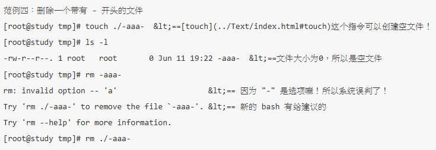

## 6.1.1 相对路径与绝对路径

    绝对路径：路径的写法“一定由根目录 / 写起”，例如： /usr/share/doc 这个目录。
    相对路径：路径的写法“不是由 / 写起”，例如由 /usr/share/doc 要到 /usr/share/man 下面时，可以写成： “cd ../man”这就是相对路径的写法啦！相对路径意指“相对于目前工作目录的路径！”

相对路径的用途

那么相对路径与绝对路径有什么了不起呀？喝！那可真的是了不起了！假设你写了一个软件， 这个软件共需要三个目录，分别是 etc, bin, man 这三个目录，然而由于不同的人喜欢安装在不同的目录之下， 假设甲安装的目录是 /usr/local/packages/etc, /usr/local/packages/bin 及 /usr/local/packages/man ，不过乙却喜欢安装在 /home/packages/etc, /home/packages/bin, /home/packages/man 这三个目录中，请问如果需要用到绝对路径的话，那么是否很麻烦呢？是的！ 如此一来每个目录下的东西就很难对应的起来！这个时候相对路径的写法就显的特别的重要了！

此外，如果你跟鸟哥一样，喜欢将路径的名字写的很长，好让自己知道那个目录是在干什么的，例如： /cluster/raid/output/taiwan2006/smoke 这个目录，而另一个目录在 /cluster/raid/output/taiwan2006/cctm ，那么我从第一个要到第二个目录去的话，怎么写比较方便？ 当然是“ cd ../cctm ”比较方便啰！对吧！

绝对路径的用途

但是对于文件名的正确性来说，“绝对路径的正确度要比较好～”。 一般来说，鸟哥会建议你，如果是在写程序 （shell scripts） 来管理系统的条件下，务必使用绝对路径的写法。 怎么说呢？因为绝对路径的写法虽然比较麻烦，但是可以肯定这个写法绝对不会有问题。 如果使用相对路径在程序当中，则可能由于你执行的工作环境不同，导致一些问题的发生。 这个问题在工作调度（at, cron, 第十五章）当中尤其重要！这个现象我们在十二章、shell script时，会再次的提醒你喔！ ^_^

### 6.1.2 目录的相关操作
我们之前稍微提到变换目录的指令是cd，还有哪些可以进行目录操作的指令呢？ 例如创建目录啊、删除目录之类的～还有，得要先知道的，就是有哪些比较特殊的目录呢？ 举例来说，下面这些就是比较特殊的目录，得要用力的记下来才行：

    .         代表此层目录
    ..        代表上一层目录
    -         代表前一个工作目录
    ~         代表“目前使用者身份”所在的主文件夹
    ~account  代表 account 这个使用者的主文件夹（account是个帐号名称）

下面我们就来谈一谈几个常见的处理目录的指令吧：

    cd：变换目录
    pwd：显示目前的目录
    mkdir：创建一个新的目录
    rmdir：删除一个空的目录

pwd （显示目前所在的目录）

    pwd是Print Working Directory的缩写，也就是显示目前所在目录的指令， 例如在上个表格最后的目录是/var/mail这个目录，但是提示字符仅显示mail， 如果你想要知道目前所在的目录，可以输入pwd即可。此外，由于很多的套件所使用的目录名称都相同，例如 /usr/local/etc还有/etc，但是通常Linux仅列出最后面那一个目录而已，这个时候你就可以使用pwd 来知道你的所在目录啰！免得搞错目录，结果...
    其实有趣的是那个 -P 的选项啦！他可以让我们取得正确的目录名称，而不是以链接文件的路径来显示的。 如果你使用的是CentOS 7.x的话，刚刚好/var/mail是/var/spool/mail的链接文件， 所以，通过到/var/mail下达pwd -P就能够知道这个选项的意义啰～ ^_^

mkdir （创建新目录）

    如果想要创建新的目录的话，那么就使用mkdir （make directory）吧！ 不过，在默认的情况下， 你所需要的目录得一层一层的创建才行！例如：假如你要创建一个目录为 /home/bird/testing/test1，那么首先必须要有 /home 然后 /home/bird ，再来 /home/bird/testing 都必须要存在，才可以创建 /home/bird/testing/test1 这个目录！假如没有 /home/bird/testing 时，就没有办法创建 test1 的目录啰！

    不过，现在有个更简单有效的方法啦！那就是加上 -p 这个选项喔！你可以直接下达：“ mkdir -p /home/bird/testing/test1 ” 则系统会自动的帮你将 /home, /home/bird, /home/bird/testing 依序的创建起目录！并且， 如果该目录本来就已经存在时，系统也不会显示错误讯息喔！挺快乐的吧！ ^_^。 不过鸟哥不建议常用-p这个选项，因为担心如果你打错字，那么目录名称就会变的乱七八糟的！

    另外，有个地方你必须要先有概念，那就是“默认权限”的地方。我们可以利用 -m 来强制给予一个新的目录相关的权限， 例如上表当中，我们给予 -m 711 来给予新的目录 drwx--x--x 的权限。不过，如果没有给予 -m 选项时， 那么默认的新建目录权限又是什么呢？这个跟 umask 有关，我们在本章后头会加以介绍的。

rmdir （删除“空”的目录）

    如果想要删除旧有的目录时，就使用rmdir吧！例如将刚刚创建的test杀掉，使用“ rmdir test ”即可！请注意呦！目录需要一层一层的删除才行！而且被删除的目录里面必定不能存在其他的目录或文件！ 这也是所谓的空的目录（empty directory）的意思啊！那如果要将所有目录下的东西都杀掉呢？！ 这个时候就必须使用“ rm -r test ”啰！不过，还是使用 rmdir 比较不危险！你也可以尝试以 -p 的选项加入，来删除上层的目录喔！ 

### 6.1.3 关于可执行文件路径的变量： $PATH

当我们在执行一个指令的时候，举例来说“ls”好了，系统会依照PATH的设置去每个PATH定义的目录下搜寻文件名为ls的可可执行文件， 如果在PATH定义的目录中含有多个文件名为ls的可可执行文件，那么先搜寻到的同名指令先被执行！

现在，请下达“echo $PATH”来看看到底有哪些目录被定义出来了？ echo有“显示、印出”的意思，而 PATH 前面加的 $ 表示后面接的是变量，所以会显示出目前的 PATH ！

PATH（一定是大写）这个变量的内容是由一堆目录所组成的，每个目录中间用冒号（:）来隔开， 每个目录是有“顺序”之分的。仔细看一下上面的输出，你可以发现到无论是root还是dmtsai都有 /bin 或 /usr/bin 这个目录在PATH变量内，所以当然就能够在任何地方执行ls来找到/bin/ls可执行文件啰！因为 /bin 在 CentOS 7 当中，就是链接到 /usr/bin 去的！ 所以这两个目录内容会一模一样！ 

例题：假设你是root，如果你将ls由/bin/ls移动成为/root/ls（可用“mv /bin/ls /root”指令达成），然后你自己本身也在/root目录下， 请问（1）你能不能直接输入ls来执行？（2）若不能，你该如何执行ls这个指令？（3）若要直接输入ls即可执行，又该如何进行？答：由于这个例题的重点是将某个可执行文件移动到非正规目录去，所以我们先要进行下面的动作才行：（务必先使用 su - 切换成为root的身份）

（1）接下来不论你在那个目录下面输入任何与ls相关的指令，都没有办法顺利的执行ls了！ 也就是说，你不能直接输入ls来执行，因为/root这个目录并不在PATH指定的目录中， 所以，即使你在/root目录下，也不能够搜寻到ls这个指令！

（2）因为这个ls确实存在于/root下面，并不是被删除了！所以我们可以通过使用绝对路径或者是相对路径直接指定这个可执行文件文件名， 下面的两个方法都能够执行ls这个指令：

（3）如果想要让root在任何目录均可执行/root下面的ls，那么就将/root加入PATH当中即可。 加入的方法很简单，就像下面这样：

上面这个作法就能够将/root加入到可执行文件搜寻路径PATH中了！不相信的话请您自行使用“echo $PATH”去查看吧！ 另外，除了 $PATH 之外，如果想要更明确的定义出变量的名称，可以使用大括号 ${PATH} 来处理变量的调用喔！ 如果确定这个例题进行没有问题了，请将ls搬回/bin下面，不然系统会挂点的！

## 6.2 文件与目录管理

### 6.2.1 文件与目录的检视： ls

在Linux系统当中，这个 ls 指令可能是最常被执行的吧！因为我们随时都要知道文件或者是目录的相关信息啊～ 不过，我们Linux的文件所记录的信息实在是太多了，ls 没有需要全部都列出来呢～ 所以，当你只有下达 ls 时，默认显示的只有：非隐藏文件的文件名、 以文件名进行排序及文件名代表的颜色显示如此而已。举例来说， 你下达“ ls /etc ”之后，只有经过排序的文件名以及以蓝色显示目录及白色显示一般文件，如此而已。

那如果我还想要加入其他的显示信息时，可以加入上头提到的那些有用的选项呢～ 举例来说，我们之前一直用到的 -l 这个长串显示数据内容，以及将隐藏文件也一起列示出来的 -a 选项等等。 下面则是一些常用的范例，实际试做看看：

### 6.2.2 复制、删除与移动： cp, rm, mv
要复制文件，请使用 cp （copy） 这个指令即可～不过， cp 这个指令的用途可多了～ 除了单纯的复制之外，还可以创建链接文件 （就是捷径啰），比对两文件的新旧而予以更新， 以及复制整个目录等等的功能呢！至于移动目录与文件，则使用 mv （move）， 这个指令也可以直接拿来作更名 （rename） 的动作喔！至于移除吗？那就是 rm （remove） 这个指令啰～下面我们就来瞧一瞧先～

rm （移除文件或目录）

mv （移动文件与目录，或更名）

### 6.2.3 取得路径的文件名称与目录名称

## 6.3 文件内容查阅
各个指令的用途吧！

cat 由第一行开始显示文件内容 
tac 从最后一行开始显示，可以看出 tac 是 cat 的倒着写！ 
nl 显示的时候，顺道输出行号！ 
more 一页一页的显示文件内容 
less 与 more 类似，但是比 more 更好的是，他可以往前翻页！ 
head 只看头几行 
tail 只看尾巴几行 
od 以二进制的方式读取文件内容！

### 6.3.1 直接检视文件内容

直接查阅一个文件的内容可以使用 cat/tac/nl 这几个指令啊！

cat （concatenate）

tac（反向列示）

nl（添加行号打印）

### 6.3.2 可翻页检视
more （一页一页翻动）

要离开 more 这个指令的显示工作，可以按下 q 就能够离开了。而要向下翻页，就使用空白键即可。 比较有用的是搜寻字串的功能，举例来说，我们使用“ more /etc/man_db.conf ”来观察该文件， 若想要在该文件内搜寻 MANPATH 这个字串时，可以这样做：

less （一页一页翻动）
less 的用法比起 more 又更加的有弹性，怎么说呢？在 more 的时候，我们并没有办法向前面翻， 只能往后面看，但若使用了 less 时，呵呵！就可以使用 [pageup] [pagedown] 等按键的功能来往前往后翻看文件，你瞧，是不是更容易使用来观看一个文件的内容了呢！

除此之外，在 less 里头可以拥有更多的“搜寻”功能喔！不止可以向下搜寻，也可以向上搜寻～ 实在是很不错用～基本上，可以输入的指令有：
空白键 ：向下翻动一页；

    [pagedown]：向下翻动一页；
    [pageup] ：向上翻动一页；
    /字串 ：向下搜寻“字串”的功能；
    ?字串 ：向上搜寻“字串”的功能；
    n ：重复前一个搜寻 （与 / 或 ? 有关！）
    N ：反向的重复前一个搜寻 （与 / 或 ? 有关！）
    g ：前进到这个数据的第一行去；
    G ：前进到这个数据的最后一行去 （注意大小写）；
    q ：离开 less 这个程序；

### 6.3.3 数据撷取

head （取出前面几行）

tail （取出后面几行）

例题：假如我想要显示 /etc/man_db.conf 的第 11 到第 20 行呢？答：这个应该不算难，想一想，在第 11 到第 20 行，那么我取前 20 行，再取后十行，所以结果就是：“ head -n 20 /etc/man_db.conf | tail -n 10 ”，这样就可以得到第 11 到第 20 行之间的内容了！

这两个指令中间有个管线 （|） 的符号存在，这个管线的意思是：“前面的指令所输出的讯息，请通过管线交由后续的指令继续使用”的意思。 所以， head -n 20 /etc/man_db.conf 会将文件内的 20 行取出来，但不输出到屏幕上，而是转交给后续的 tail 指令继续处理。 因此 tail “不需要接文件名”，因为 tail 所需要的数据是来自于 head 处理后的结果！这样说，有没有理解？

更多的管线命令，我们会在第三篇继续解释的！

例题：承上一题，那如果我想要列出正确的行号呢？就是屏幕上仅列出 /etc/man_db.conf 的第 11 到第 20 行，且有行号存在？答：我们可以通过 cat -n 来带出行号，然后再通过 head/tail 来撷取数据即可！所以就变成如下的模样了： cat -n /etc/man_db.conf | head -n 20 | tail -n 10

### 6.3.4 非纯文本文件： od

我们上面提到的，都是在查阅纯文本文件的内容。那么万一我们想要查阅非文本文件，举例来说，例如 /usr/bin/passwd 这个可执行文件的内容时， 又该如何去读出信息呢？事实上，由于可执行文件通常是 binary file ，使用上头提到的指令来读取他的内容时， 确实会产生类似乱码的数据啊！那怎么办？没关系，我们可以利用 od 这个指令来读取喔！

### 6.3.5 修改文件时间或创建新文件： touch

我们在 ls 这个指令的介绍时，有稍微提到每个文件在linux下面都会记录许多的时间参数， 其实是有三个主要的变动时间，那么三个时间的意义是什么呢？

    modification time （mtime）： 当该文件的“内容数据”变更时，就会更新这个时间！内容数据指的是文件的内容，而不是文件的属性或权限喔！

    status time （ctime）： 当该文件的“状态 （status）”改变时，就会更新这个时间，举例来说，像是权限与属性被更改了，都会更新这个时间啊。

    access time （atime）： 当“该文件的内容被取用”时，就会更新这个读取时间 （access）。举例来说，我们使用 cat 去读取 /etc/man_db.conf ， 就会更新该文件的 atime 了。

文件的时间是很重要的，因为，如果文件的时间误判的话，可能会造成某些程序无法顺利的运行。 OK！那么万一我发现了一个文件来自未来，该如何让该文件的时间变成“现在”的时刻呢？ 很简单啊！就用“touch”这个指令即可！

通过 touch 这个指令，我们可以轻易的修订文件的日期与时间。并且也可以创建一个空的文件喔！ 不过，要注意的是，即使我们复制一个文件时，复制所有的属性，但也没有办法复制 ctime 这个属性的。 ctime 可以记录这个文件最近的状态 （status） 被改变的时间。无论如何，还是要告知大家， 我们平时看的文件属性中，比较重要的还是属于那个 mtime 啊！我们关心的常常是这个文件的“内容” 是什么时候被更动的说～瞭乎？
无论如何， touch 这个指令最常被使用的情况是：

创建一个空的文件；
将某个文件日期修订为目前 （mtime 与 atime）

## 6.4 文件与目录的默认权限与隐藏权限
你的系统有个一般身份使用者 dmtsai，他的群组属于 dmtsai，他的主文件夹在 /home/dmtsai， 你是root，你想将你的 ~/.bashrc 复制给他，可以怎么作？答：由上一章的权限概念我们可以知道 root 虽然可以将这个文件复制给 dmtsai，不过这个文件在 dmtsai 的主文件夹中却可能让 dmtsai 没有办法读写（因为该文件属于 root 的嘛！而 dmtsai 又不能使用 chown 之故）。 此外，我们又担心覆盖掉 dmtsai 自己的 .bashrc 配置文件，因此，我们可以进行如下的动作喔： 复制文件： cp ~/.bashrc ~dmtsai/bashrc 修改属性： chown dmtsai:dmtsai ~dmtsai/bashrc

我想在 /tmp 下面创建一个目录，这个目录名称为 chapter6_1 ，并且这个目录拥有者为 dmtsai， 群组为 dmtsai，此外，任何人都可以进入该目录浏览文件，不过除了 dmtsai 之外，其他人都不能修改该目录下的文件。答：因为除了 dmtsai 之外，其他人不能修改该目录下的文件，所以整个目录的权限应该是 drwxr-xr-x 才对！ 因此你应该这样做：创建目录： mkdir /tmp/chapter6_1 修改属性： chown -R dmtsai:dmtsai /tmp/chapter6_1 修改权限： chmod -R 755 /tmp/chapter6_1

### 6.4.1 文件默认权限：umask
不过， 你知道当你创建一个新的文件或目录时，他的默认权限会是什么吗？呵呵！那就与 umask 这个玩意儿有关了！那么 umask 是在搞什么呢？基本上， umask 就是指定 “目前使用者在创建文件或目录时候的权限默认值”， 那么如何得知或设置 umask 呢？他的指定条件以下面的方式来指定：

在默认权限的属性上，目录与文件是不一样的。从第五章我们知道 x 权限对于目录是非常重要的！ 但是一般文件的创建则不应该有执行的权限，因为一般文件通常是用在于数据的记录嘛！当然不需要执行的权限了。 因此，默认的情况如下：

    若使用者创建为“文件”则默认“没有可执行（ x ）权限”，亦即只有 rw 这两个项目，也就是最大为 666 分，默认权限如下： -rw-rw-rw-

    若使用者创建为“目录”，则由于 x 与是否可以进入此目录有关，因此默认为所有权限均开放，亦即为 777 分，默认权限如下： drwxrwxrwx

要注意的是，umask 的分数指的是“该默认值需要减掉的权限！”因为 r、w、x 分别是 4、2、1 分，所以啰！也就是说，当要拿掉能写的权限，就是输入 2 分，而如果要拿掉能读的权限，也就是 4 分，那么要拿掉读与写的权限，也就是 6 分，而要拿掉执行与写入的权限，也就是 3 分，这样了解吗？请问你， 5 分是什么？呵呵！ 就是读与执行的权限啦！

umask的利用与重要性：专题制作
想像一个状况，如果你跟你的同学在同一部主机里面工作时，因为你们两个正在进行同一个专题， 老师也帮你们两个的帐号创建好了相同群组的状态，并且将 /home/class/ 目录做为你们两个人的专题目录。 想像一下，有没有可能你所制作的文件你的同学无法编辑？果真如此的话，那就伤脑筋了！

### 6.4.2 文件隐藏属性
光是那九个权限就快要疯掉了，竟然还有隐藏属性，真是要命～ 但是没办法，就是有文件的隐藏属性存在啊！不过，这些隐藏的属性确实对于系统有很大的帮助的～ 尤其是在系统安全 （Security） 上面，重要的紧呢！不过要先强调的是，下面的chattr指令只能在Ext2/Ext3/Ext4的 Linux 传统文件系统上面完整生效， 其他的文件系统可能就无法完整的支持这个指令了，例如 xfs 仅支持部份参数而已。下面我们就来谈一谈如何设置与检查这些隐藏的属性吧！

    [root@study ~]# chattr [+-=][ASacdistu] 文件或目录名称  
    选项与参数：
    +   ：增加某一个特殊参数，其他原本存在参数则不动。
    -   ：移除某一个特殊参数，其他原本存在参数则不动。
    =   ：设置一定，且仅有后面接的参数
    A  ：当设置了 A 这个属性时，若你有存取此文件（或目录）时，他的存取时间 atime 将不会被修改，
        可避免 I/O 较慢的机器过度的存取磁盘。（目前建议使用文件系统挂载参数处理这个项目）
    S  ：一般文件是非同步写入磁盘的（原理请参考[前一章sync](../Text/index.html#sync)的说明），如果加上 S 这个属性时，
        当你进行任何文件的修改，该更动会“同步”写入磁盘中。
    a  ：当设置 a 之后，这个文件将只能增加数据，而不能删除也不能修改数据，只有root 才能设置这属性
    c  ：这个属性设置之后，将会自动的将此文件“压缩”，在读取的时候将会自动解压缩，
        但是在储存的时候，将会先进行压缩后再储存（看来对于大文件似乎蛮有用的！）
    d  ：当 dump 程序被执行的时候，设置 d 属性将可使该文件（或目录）不会被 dump 备份
    i  ：这个 i 可就很厉害了！他可以让一个文件“不能被删除、改名、设置链接也无法写入或新增数据！”
        对于系统安全性有相当大的助益！只有 root 能设置此属性
    s  ：当文件设置了 s 属性时，如果这个文件被删除，他将会被完全的移除出这个硬盘空间，
        所以如果误删了，完全无法救回来了喔！
    u  ：与 s 相反的，当使用 u 来设置文件时，如果该文件被删除了，则数据内容其实还存在磁盘中，
        可以使用来救援该文件喔！

这个指令是很重要的，尤其是在系统的数据安全上面！由于这些属性是隐藏的性质，所以需要以 lsattr 才能看到该属性呦！其中，个人认为最重要的当属 +i 与 +a 这个属性了。+i 可以让一个文件无法被更动，对于需要强烈的系统安全的人来说， 真是相当的重要的！里头还有相当多的属性是需要 root 才能设置的呢！

lsattr （显示文件隐藏属性）

    [root@study ~]# lsattr [-adR] 文件或目录
    选项与参数：
    -a ：将隐藏文件的属性也秀出来；
    -d ：如果接的是目录，仅列出目录本身的属性而非目录内的文件名；
    -R ：连同子目录的数据也一并列出来！

    [root@study tmp]# chattr +aiS attrtest
    [root@study tmp]# lsattr attrtest
    --S-ia---------- attrtest

### 6.4.3 文件特殊权限： SUID, SGID, SBIT
但是，眼尖的朋友们在第五章的目录树章节中， 一定注意到了一件事，那就是，怎么我们的 /tmp 权限怪怪的？ 还有，那个 /usr/bin/passwd 也怪怪的？怎么回事啊？看看先：

    [root@study ~]# ls -ld /tmp ; ls -l /usr/bin/passwd
    drwxrwxrwt. 14 root root 4096 Jun 16 01:27 /tmp
    -rwsr-xr-x. 1 root root 27832 Jun 10  2014 /usr/bin/passwd

Set UID

当 s 这个标志出现在文件拥有者的 x 权限上时，例如刚刚提到的 /usr/bin/passwd 这个文件的权限状态：“-rwsr-xr-x”，此时就被称为 Set UID，简称为 SUID 的特殊权限。 那么SUID的权限对于一个文件的特殊功能是什么呢？基本上SUID有这样的限制与功能：

    SUID 权限仅对二进制程序（binary program）有效；
    执行者对于该程序需要具有 x 的可执行权限；
    本权限仅在执行该程序的过程中有效 （run-time）；
    执行者将具有该程序拥有者 （owner） 的权限。

讲这么硬的东西你可能对于 SUID 还是没有概念，没关系，我们举个例子来说明好了。 我们的 Linux 系统中，所有帐号的密码都记录在 /etc/shadow 这个文件里面，这个文件的权限为：“---------- 1 root root”，意思是这个文件仅有root可读且仅有root可以强制写入而已。 既然这个文件仅有 root 可以修改，那么鸟哥的 dmtsai 这个一般帐号使用者能否自行修改自己的密码呢？ 你可以使用你自己的帐号输入“passwd”这个指令来看看，嘿嘿！一般使用者当然可以修改自己的密码了！

唔！有没有冲突啊！明明 /etc/shadow 就不能让 dmtsai 这个一般帐户去存取的，为什么 dmtsai 还能够修改这个文件内的密码呢？ 这就是 SUID 的功能啦！借由上述的功能说明，我们可以知道

    dmtsai 对于 /usr/bin/passwd 这个程序来说是具有 x 权限的，表示 dmtsai 能执行 passwd；
    passwd 的拥有者是 root 这个帐号；
    dmtsai 执行 passwd 的过程中，会“暂时”获得 root 的权限；
    /etc/shadow 就可以被 dmtsai 所执行的 passwd 所修改。

但如果 dmtsai 使用 cat 去读取 /etc/shadow 时，他能够读取吗？因为 cat 不具有 SUID 的权限，所以 dmtsai 执行 “cat /etc/shadow” 时，是不能读取 /etc/shadow 的。我们用一张示意图来说明如下：

另外，SUID 仅可用在binary program 上， 不能够用在 shell script 上面！这是因为 shell script 只是将很多的 binary 可执行文件叫进来执行而已！所以 SUID 的权限部分，还是得要看 shell script 调用进来的程序的设置， 而不是 shell script 本身。当然，SUID 对于目录也是无效的～这点要特别留意。

Set GID
当 s 标志在文件拥有者的 x 项目为 SUID，那 s 在群组的 x 时则称为 Set GID, SGID 啰！是这样没错！^_^。 举例来说，你可以用下面的指令来观察到具有 SGID 权限的文件喔：

    [root@study ~]# ls -l /usr/bin/locate
    -rwx--s--x. 1 root slocate 40496 Jun 10  2014 /usr/bin/locate

与 SUID 不同的是，SGID 可以针对文件或目录来设置！如果是对文件来说， SGID 有如下的功能：

    SGID 对二进制程序有用；
    程序执行者对于该程序来说，需具备 x 的权限；
    执行者在执行的过程中将会获得该程序群组的支持！

与 SUID 非常的类似，若我使用 dmtsai 这个帐号去执行 locate 时，那 dmtsai 将会取得 slocate 群组的支持， 因此就能够去读取 mlocate.db 啦！非常有趣吧！

除了 binary program 之外，事实上 SGID 也能够用在目录上，这也是非常常见的一种用途！ 当一个目录设置了 SGID 的权限后，他将具有如下的功能：

    使用者若对于此目录具有 r 与 x 的权限时，该使用者能够进入此目录；
    使用者在此目录下的有效群组（effective group）将会变成该目录的群组；
    用途：若使用者在此目录下具有 w 的权限（可以新建文件），则使用者所创建的新文件，该新文件的群组与此目录的群组相同。

Sticky Bit
这个 Sticky Bit, SBIT 目前只针对目录有效，对于文件已经没有效果了。SBIT 对于目录的作用是：

    当使用者对于此目录具有 w, x 权限，亦即具有写入的权限时；
    当使用者在该目录下创建文件或目录时，仅有自己与 root 才有权力删除该文件

换句话说：当甲这个使用者于 A 目录是具有群组或其他人的身份，并且拥有该目录 w 的权限， 这表示“甲使用者对该目录内任何人创建的目录或文件均可进行 "删除/更名/搬移" 等动作。” 不过，如果将 A 目录加上了 SBIT 的权限项目时， 则甲只能够针对自己创建的文件或目录进行删除/更名/移动等动作，而无法删除他人的文件。

举例来说，我们的 /tmp 本身的权限是“drwxrwxrwt”， 在这样的权限内容下，任何人都可以在 /tmp 内新增、修改文件，但仅有该文件/目录创建者与 root 能够删除自己的目录或文件。这个特性也是挺重要的啊！你可以这样做个简单的测试：

    以 root 登陆系统，并且进入 /tmp 当中；
    touch test，并且更改 test 权限成为 777 ；
    以一般使用者登陆，并进入 /tmp；
    尝试删除 test 这个文件！

SUID/SGID/SBIT 权限设置
前面介绍过 SUID 与 SGID 的功能，那么如何设置文件使成为具有 SUID 与 SGID 的权限呢？ 这就需要第五章的数字更改权限的方法了！ 现在你应该已经知道数字体态更改权限的方式为“三个数字”的组合， 那么如果在这三个数字之前再加上一个数字的话，最前面的那个数字就代表这几个权限了！

    4 为 SUID
    2 为 SGID
    1 为 SBIT

## 6.5 指令与文件的搜寻

### 6.5.1 指令文件名的搜寻
我们知道在终端机模式当中，连续输入两次[tab]按键就能够知道使用者有多少指令可以下达。 那你知不知道这些指令的完整文件名放在哪里？举例来说，ls 这个常用的指令放在哪里呢？ 就通过 which 或 type 来找寻吧！

which：
        [root@study ~]# which [-a] command
    选项或参数：
    -a ：将所有由 PATH 目录中可以找到的指令均列出，而不止第一个被找到的指令名称

    范例一：搜寻 ifconfig 这个指令的完整文件名
    [root@study ~]# which ifconfig
    /sbin/ifconfig 

    范例二：用 which 去找出 which 的文件名为何？
    [root@study ~]# which which
    alias which='alias &#124; /usr/bin/which --tty-only --read-alias --show-dot --show-tilde'
            /bin/alias
            /usr/bin/which
    # 竟然会有两个 which ，其中一个是 alias 这玩意儿呢！那是啥？
    # 那就是所谓的“命令别名”，意思是输入 which 会等于后面接的那串指令啦！
    # 更多的数据我们会在 bash 章节中再来谈的！

    范例三：请找出 history 这个指令的完整文件名
    [root@study ~]# which history
    /usr/bin/which: no history in （/usr/local/sbin:/usr/local/bin:/sbin:/bin:
    /usr/sbin:/usr/bin:/root/bin）

    [root@study ~]# history --help
    -bash: history: --: invalid option
    history: usage: history [-c] [-d offset] [n] or history -anrw [filename] or history -ps arg 
    # 瞎密？怎么可能没有 history ，我明明就能够用 root 执行 history 的啊！

这个指令是根据“PATH”这个环境变量所规范的路径，去搜寻“可执行文件”的文件名～ 所以，重点是找出“可执行文件”而已！且 which 后面接的是“完整文件名”喔！若加上 -a 选项，则可以列出所有的可以找到的同名可执行文件，而非仅显示第一个而已！

最后一个范例最有趣，怎么 history 这个常用的指令竟然找不到啊！为什么呢？这是因为 history 是“bash 内置的指令”啦！ 但是 which 默认是找 PATH 内所规范的目录，所以当然一定找不到的啊（有 bash 就有 history！）！那怎办？没关系！我们可以通过 type 这个指令喔！ 关于 type 的用法我们将在 第十章的 bash 再来谈！

## 6.5.2 文件，文件名搜寻
在 Linux 下面也有相当优异的搜寻指令呦！通常 find 不很常用的！因为速度慢之外， 也很操硬盘！一般我们都是先使用 whereis 或者是 locate 来检查，如果真的找不到了，才以 find 来搜寻呦！ 为什么呢？因为 whereis 只找系统中某些特定目录下面的文件而已，locate 则是利用数据库来搜寻文件名，当然两者就相当的快速， 并且没有实际的搜寻硬盘内的文件系统状态，比较省时间啦！

whereis （由一些特定的目录中寻找文件文件名）

    [root@study ~]# whereis [-bmsu] 文件或目录名
    选项与参数：
    -l    :可以列出 whereis 会去查询的几个主要目录而已
    -b    :只找 binary 格式的文件
    -m    :只找在说明文档 manual 路径下的文件
    -s    :只找 source 来源文件
    -u    :搜寻不在上述三个项目当中的其他特殊文件

    范例一：请找出 ifconfig 这个文件名
    [root@study ~]# whereis ifconfig 
    ifconfig: /sbin/ifconfig /usr/share/man/man8/ifconfig.8.gz

    范例二：只找出跟 passwd 有关的“说明文档”文件名（man page）
    [root@study ~]# whereis passwd     # 全部的文件名通通列出来！
    passwd: /usr/bin/passwd /etc/passwd /usr/share/man/man1/passwd.1.gz /usr/share/man/man5/passwd.5.gz
    [root@study ~]# whereis -m passwd  # 只有在 man 里面的文件名才抓出来！
    passwd: /usr/share/man/man1/passwd.1.gz /usr/share/man/man5/passwd.5.gz

那么 whereis 到底是使用什么咚咚呢？为何搜寻的速度会比 find 快这么多？ 其实那也没有什么，只是因为 whereis 只找几个特定的目录而已～并没有全系统去查询之故。所以说，whereis 主要是针对 /bin /sbin 下面的可执行文件， 以及 /usr/share/man 下面的 man page 文件，跟几个比较特定的目录来处理而已。所以速度当然快的多！不过，就有某些文件是你找不到的啦！ 想要知道 whereis 到底查了多少目录？可以使用 whereis -l 来确认一下即可！

locate:
    [root@study ~]# locate [-ir] keyword
    选项与参数：
    -i  ：忽略大小写的差异；
    -c  ：不输出文件名，仅计算找到的文件数量
    -l  ：仅输出几行的意思，例如输出五行则是 -l 5
    -S  ：输出 locate 所使用的数据库文件的相关信息，包括该数据库纪录的文件/目录数量等
    -r  ：后面可接正则表达式的显示方式

    范例一：找出系统中所有与 passwd 相关的文件名，且只列出 5 个
    [root@study ~]# locate -l 5 passwd
    /etc/passwd
    /etc/passwd-
    /etc/pam.d/passwd
    /etc/security/opasswd
    /usr/bin/gpasswd

    范例二：列出 locate 查询所使用的数据库文件之文件名与各数据数量
    [root@study ~]# locate -S
    Database /var/lib/mlocate/mlocate.db:
        8,086 directories     # 总纪录目录数
        109,605 files         # 总纪录文件数
        5,190,295 Bytes in file names
        2,349,150 Bytes used to store database

这个 locate 的使用更简单，直接在后面输入“文件的部分名称”后，就能够得到结果。 举上面的例子来说，我输入 locate passwd ，那么在完整文件名 （包含路径名称） 当中，只要有 passwd 在其中， 就会被显示出来的！这也是个很方便好用的指令，如果你忘记某个文件的完整文件名时～～

但是，这个东西还是有使用上的限制呦！为什么呢？你会发现使用 locate 来寻找数据的时候特别的快， 这是因为 locate 寻找的数据是由“已创建的数据库 /var/lib/mlocate/” 里面的数据所搜寻到的，所以不用直接在去硬盘当中存取数据，呵呵！当然是很快速啰！

那么有什么限制呢？就是因为他是经由数据库来搜寻的，而数据库的创建默认是在每天执行一次 （每个 distribution 都不同，CentOS 7.x 是每天更新数据库一次！），所以当你新创建起来的文件， 却还在数据库更新之前搜寻该文件，那么 locate 会告诉你“找不到！”呵呵！因为必须要更新数据库呀！

那能否手动更新数据库哪？当然可以啊！更新 locate 数据库的方法非常简单，直接输入“ updatedb ”就可以了！ updatedb 指令会去读取 /etc/updatedb.conf 这个配置文件的设置，然后再去硬盘里面进行搜寻文件名的动作， 最后就更新整个数据库文件啰！因为 updatedb 会去搜寻硬盘，所以当你执行 updatedb 时，可能会等待数分钟的时间喔！

find:
    [root@study ~]# find [PATH] [option] [action]
选项与参数：
1\. 与时间有关的选项：共有 -atime, -ctime 与 -mtime ，以 -mtime 说明
   -mtime  n ：n 为数字，意义为在 n 天之前的“一天之内”被更动过内容的文件；
   -mtime +n ：列出在 n 天之前（不含 n 天本身）被更动过内容的文件文件名；
   -mtime -n ：列出在 n 天之内（含 n 天本身）被更动过内容的文件文件名。
   -newer file ：file 为一个存在的文件，列出比 file 还要新的文件文件名

    范例一：将过去系统上面 24 小时内有更动过内容 （mtime） 的文件列出
    [root@study ~]# find / -mtime 0
    # 那个 0 是重点！0 代表目前的时间，所以，从现在开始到 24 小时前，
    # 有变动过内容的文件都会被列出来！那如果是三天前的 24 小时内？
    # find / -mtime 3 有变动过的文件都被列出的意思！

    范例二：寻找 /etc 下面的文件，如果文件日期比 /etc/passwd 新就列出
    [root@study ~]# find /etc -newer /etc/passwd
    # -newer 用在分辨两个文件之间的新旧关系是很有用的！

    范例3，查找系统上过去5-10天被改动的文件:
    find / -mtime +4 -mtime -10

    atime(访问时间)，ctime（更改链接数，元数据，权限等），mtime（文件内容被修改）

时间参数真是挺有意思的！我们现在知道 atime, ctime 与 mtime 的意义，如果你想要找出一天内被更动过的文件名称， 可以使用上述范例一的作法。但如果我想要找出“4天内被更动过的文件文件名”呢？那可以使用“ find /var -mtime -4 ”。那如果是“4天前的那一天”就用“ find /var -mtime 4 ”。有没有加上“+, -”差别很大喔！我们可以用简单的图示来说明一下：

其他参数：

    选项与参数：
    与使用者或群组名称有关的参数：
    -uid n ：n 为数字，这个数字是使用者的帐号 ID，亦即 UID ，这个 UID 是记录在
            /etc/passwd 里面与帐号名称对应的数字。这方面我们会在第四篇介绍。
    -gid n ：n 为数字，这个数字是群组名称的 ID，亦即 GID，这个 GID 记录在
            /etc/group，相关的介绍我们会第四篇说明～
    -user name ：name 为使用者帐号名称喔！例如 dmtsai 
    -group name：name 为群组名称喔，例如 users ；
    -nouser    ：寻找文件的拥有者不存在 /etc/passwd 的人！
    -nogroup   ：寻找文件的拥有群组不存在于 /etc/group 的文件！
                当你自行安装软件时，很可能该软件的属性当中并没有文件拥有者，
                这是可能的！在这个时候，就可以使用 -nouser 与 -nogroup 搜寻。

    范例三：搜寻 /home 下面属于 dmtsai 的文件
    [root@study ~]# find /home -user dmtsai
    # 这个东西也很有用的～当我们要找出任何一个使用者在系统当中的所有文件时，
    # 就可以利用这个指令将属于某个使用者的所有文件都找出来喔！

    范例四：搜寻系统中不属于任何人的文件
    [root@study ~]# find / -nouser
    # 通过这个指令，可以轻易的就找出那些不太正常的文件。如果有找到不属于系统任何人的文件时，
    # 不要太紧张，那有时候是正常的～尤其是你曾经以源代码自行编译软件时。

如果你想要找出某个使用者在系统下面创建了啥咚咚，使用上述的选项与参数，就能够找出来啦！ 至于那个 -nouser 或 -nogroup 的选项功能中，除了你自行由网络上面下载文件时会发生之外， 如果你将系统里面某个帐号删除了，但是该帐号已经在系统内创建很多文件时，就可能会发生无主孤魂的文件存在！ 此时你就得使用这个 -nouser 来找出该类型的文件啰！

    选项与参数：
    3\. 与文件权限及名称有关的参数：
    -name filename：搜寻文件名称为 filename 的文件；
    -size [+-]SIZE：搜寻比 SIZE 还要大（+）或小（-）的文件。这个 SIZE 的规格有：
                    c: 代表 Byte， k: 代表 1024Bytes。所以，要找比 50KB
                    还要大的文件，就是“ -size +50k ”
    -type TYPE    ：搜寻文件的类型为 TYPE 的，类型主要有：一般正规文件 （f）, 设备文件 （b, c）,
                    目录 （d）, 链接文件 （l）, socket （s）, 及 FIFO （p） 等属性。
    -perm mode  ：搜寻文件权限“刚好等于” mode 的文件，这个 mode 为类似 chmod
                    的属性值，举例来说， -rwsr-xr-x 的属性为 4755 ！
    -perm -mode ：搜寻文件权限“必须要全部囊括 mode 的权限”的文件，举例来说，
                    我们要搜寻 -rwxr--r-- ，亦即 0744 的文件，使用 -perm -0744，
                    当一个文件的权限为 -rwsr-xr-x ，亦即 4755 时，也会被列出来，
                    因为 -rwsr-xr-x 的属性已经囊括了 -rwxr--r-- 的属性了。
    -perm /mode ：搜寻文件权限“包含任一 mode 的权限”的文件，举例来说，我们搜寻
                    -rwxr-xr-x ，亦即 -perm /755 时，但一个文件属性为 -rw-------
                    也会被列出来，因为他有 -rw.... 的属性存在！

    范例五：找出文件名为 passwd 这个文件
    [root@study ~]# find / -name passwd

    范例五-1：找出文件名包含了 passwd 这个关键字的文件
    [root@study ~]# find / -name "*passwd*"
    # 利用这个 -name 可以搜寻文件名啊！默认是完整文件名，如果想要找关键字，
    # 可以使用类似 * 的任意字符来处理

    范例六：找出 /run 目录下，文件类型为 Socket 的文件名有哪些？
    [root@study ~]# find /run -type s
    # 这个 -type 的属性也很有帮助喔！尤其是要找出那些怪异的文件，
    # 例如 socket 与 FIFO 文件，可以用 find /run -type p 或 -type s 来找！

    范例七：搜寻文件当中含有 SGID 或 SUID 或 SBIT 的属性
    [root@study ~]# find / -perm /7000 
    # 所谓的 7000 就是 ---s--s--t ，那么只要含有 s 或 t 的就列出，所以当然要使用 /7000，
    # 使用 -7000 表示要同时含有 ---s--s--t 的所有三个权限。而只需要任意一个，就是 /7000 ～瞭乎？